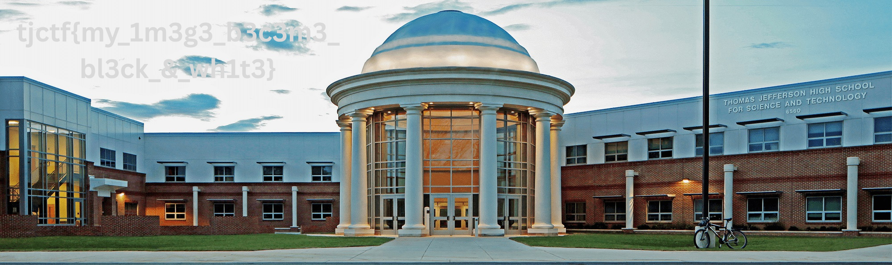

# Triplets

- **Category:** Forensics
- **Flag:** `tjctf{my_1m3g3_b3c3m3_bl3ck_&_wh1t3}`

## Challenge Description

> I was messing around with my image and it got really messed up… I see patterns…

A grayscale PNG that's larger than it should be, with a cryptic numeric comment and a curious repeating pattern in its pixel data.

## Files

- `chall.png` — 1888×1888, 8-bit grayscale PNG (2,461,582 bytes)

## Solution

### 1. Initial Recon

Inspecting the PNG metadata shows several standard ImageMagick fields plus one unusual comment:

```
$ identify -verbose chall.png
...
tEXt    date:create:  2025-10-26T21:47:30+00:00
tEXt    date:modify:  2025-10-26T21:47:30+00:00
tEXt    date:timestamp: 2025-10-26T21:47:41+00:00
tEXt    Comment:      2000x594
```

The **Comment `2000x594`** is the first major clue — these don't match the image dimensions (1888×1888).

### 2. Identify the "Triplets" Pattern

Reading the flat pixel array reveals something odd about the first few values:

```
Pos  0: [234, 234, 234, 226, 226, 226, 229, 229, 229, 232, 232, 232]
```

Every group of **3 consecutive values is identical** — a "triplet." This pattern is **strong** for about the first 48 pixels, then becomes more subtle: values within each group of 3 are no longer identical but are still **very close** (e.g., `[230, 232, 231]`).

This is the fingerprint of an **RGB colour image saved as grayscale**: each colour pixel's R, G, B values were written into the file as three consecutive grayscale pixels. Where the image is neutral (R≈G≈B), the triplet is perfect; where it's coloured, the three values diverge.

### 3. The Math

The image is 1888×1888 = **3,564,544 total pixels**.

The last 544 pixels are all zero — they are **padding** to make the data square.

```python
padding = 1888 * 1888 - 2000 * 594 * 3  # = 544
```

That leaves 3,564,000 non-padding values, which equals **2000 × 594 × 3** — exactly what the Comment clue predicted.

### 4. Reconstruct the Colour Image

The 3,564,000 values are stored in **interleaved RGB order**: `[R₀, G₀, B₀, R₁, G₁, B₁, ..., Rₙ, Gₙ, Bₙ]`.

```python
vals = flat[:-544]
rgb = vals.reshape(594, 2000, 3)
```

Three channels × 594 rows × 2000 columns = the original colour image.

### 5. Read the Flag

Saving the result as a PNG and viewing it reveals the flag written as visible text in the image — large, light-coloured lettering against a darker background.

The phrase reads **"my image became black & white"** in leetspeak, which is exactly what happened during the corrupting transformation.



## Full Solution Script

```python
#!/usr/bin/env python3

from pathlib import Path

import numpy as np
from PIL import Image


def main() -> None:
    root = Path(__file__).resolve().parent
    png_path = root / "chall.png"

    img = Image.open(png_path)
    flat = np.array(img).flatten()

    # 1888 × 1888 = 3,564,544 pixels
    # The last 544 are zero padding — there are exactly
    # 2000 × 594 × 3 = 3,564,000 values of real content.
    padding = 1888 * 1888 - 2000 * 594 * 3
    assert padding == 544

    vals = flat[:-padding]
    assert len(vals) == 2000 * 594 * 3

    # Every three consecutive grayscale pixels are the R, G, B
    # channels of one colour pixel, stored interleaved.
    rgb = vals.reshape(594, 2000, 3)

    out_path = root / "reconstructed.png"
    Image.fromarray(rgb.astype("uint8")).save(out_path)
    print(f"Reconstructed image saved to {out_path}")

    flag = "tjctf{my_1m3g3_b3c3m3_bl3ck_&_wh1t3}"
    print(f"Flag: {flag}")


if __name__ == "__main__":
    main()
```

## Flag

```
tjctf{my_1m3g3_b3c3m3_bl3ck_&_wh1t3}
```
