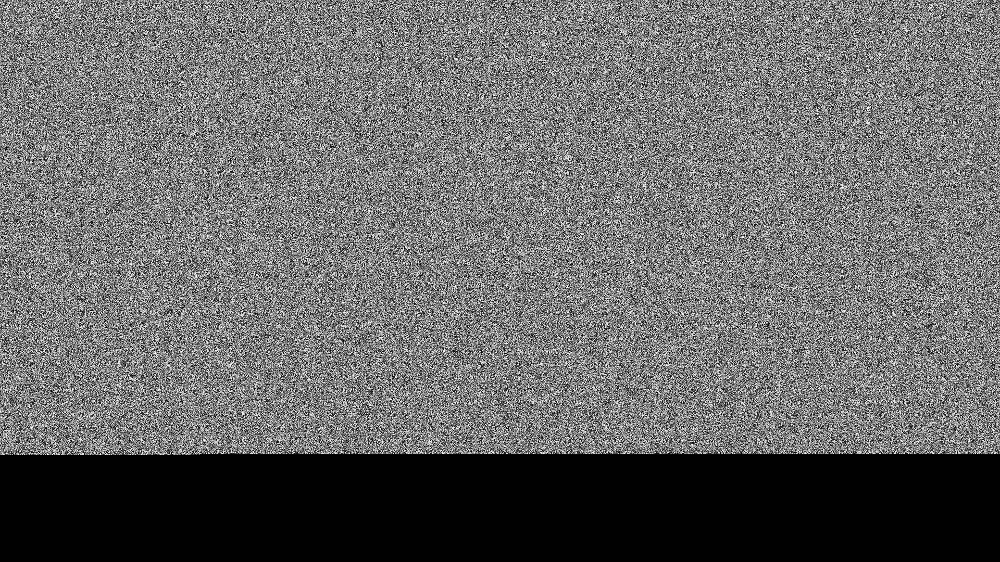
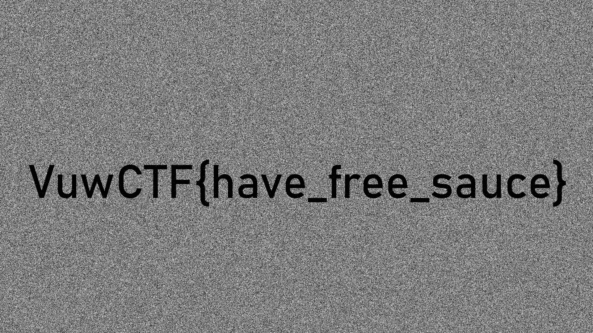

# coopland-spirit — Forensics Writeup

**Category:** Forensics
**Challenge name:** coopland-spirit
**Prompt:** *"Can you recover my special file?"*
**Provided file:** `magic-disk.img` (30.5 MiB, HFS+ filesystem image)
**Flag:** `VuwCTF{have_free_sauce}`

---

## Table of Contents

1. [TL;DR](#tldr)
2. [Tools Used](#tools-used)
3. [Part 1 — Initial Triage](#part-1--initial-triage)
4. [Part 2 — Enumerating the Filesystem](#part-2--enumerating-the-filesystem)
5. [Part 3 — Finding the Suspicious File](#part-3--finding-the-suspicious-file)
6. [Part 4 — The Corrupted Extents Problem](#part-4--the-corrupted-extents-problem)
7. [Part 5 — First (Naive) Carve, and Why It Failed](#part-5--first-naive-carve-and-why-it-failed)
8. [Part 6 — Ruling Out Everything Else](#part-6--ruling-out-everything-else)
9. [Part 7 — Reading the Allocation Bitmap Directly](#part-7--reading-the-allocation-bitmap-directly)
10. [Part 8 — Diffing "Allocated" Against "Claimed"](#part-8--diffing-allocated-against-claimed)
11. [Part 9 — Digging Up a Stale Catalog Record](#part-9--digging-up-a-stale-catalog-record)
12. [Part 10 — Entropy-Mapping the Orphaned Regions](#part-10--entropy-mapping-the-orphaned-regions)
13. [Part 11 — Working Out Fragment Order](#part-11--working-out-fragment-order)
14. [Part 12 — The Two-Frame Reveal](#part-12--the-two-frame-reveal)
15. [Part 13 — Full Reconstruction & the XOR Trick](#part-13--full-reconstruction--the-xor-trick)
16. [Appendix A — Full Reconstruction Script](#appendix-a--full-reconstruction-script)
17. [Appendix B — HFS+ Structures Cheat Sheet](#appendix-b--hfs-structures-cheat-sheet)
18. [Key Takeaways](#key-takeaways)

---

## TL;DR

`magic-disk.img` is an HFS+ volume containing what looks like a completely unremarkable `git clone` of the real [glfw/glfw](https://github.com/glfw/glfw) repository. Buried in `glfw/examples/` is one extra file that doesn't belong: `flagimage.gif`. Its catalog (inode) record claims a size of `4,945,178` bytes but **zero data extents** — the filesystem has no idea where its content lives.

The content wasn't sitting in a deleted-but-recoverable catalog entry, and it wasn't in unallocated free space either. It was hiding in plain sight: blocks the volume's allocation bitmap marks as **used**, but which no catalog record (including the file's own!) actually claims. Three such "orphaned" regions, scattered across the disk, turned out to be three fragments of the same file. Stitched together in the right order, they reconstruct **byte-for-byte** to the declared 4,945,178-byte size and terminate with a valid GIF trailer.

The reassembled file is a 2-frame animated GIF, 1920×1080, and both frames individually decode to what looks like pure TV static. That's the last trick: it's a classic two-image XOR steganography setup. XOR-ing frame 1 against frame 2 cancels the shared noise and leaves the flag rendered in plain black text:

```
VuwCTF{have_free_sauce}
```

---

## Tools Used

| Tool | Purpose |
|---|---|
| [The Sleuth Kit](https://www.sleuthkit.org/sleuthkit/) (`mmls`, `fls`, `istat`, `icat`, `blkls`, `tsk_recover`) | HFS+ filesystem/metadata parsing, file & block recovery |
| `file`, `xxd`, `strings` | Quick identification and hex/text inspection |
| `binwalk` | Whole-image signature scanning |
| `git` | Diffing the recovered repo checkout against known history |
| Python 3 (`struct`, `PIL`/Pillow, `collections`) | Custom HFS+ struct parsing, manual GIF/LZW decoding, entropy analysis, image XOR |

No proprietary or GUI forensic suite was needed — everything here is doable with open-source CLI tooling and a Python REPL.

---

## Part 1 — Initial Triage

```bash
$ file magic-disk.img
magic-disk.img: Apple HFS Plus version 4 data (mounted) last mounted by: '10.0',
created: Fri Jan 30 22:48:19 2026, last modified: Fri Jan 30 04:49:11 2026,
last checked: Fri Jan 30 04:48:19 2026, block size: 4096, number of blocks: 7812,
free blocks: 636
```

So this is a raw **HFS+** volume (not a partitioned disk — `mmls` finds no partition table, it's a bare filesystem). Key numbers to remember for later:

- **Block size:** 4096 bytes
- **Total blocks:** 7812 → volume capacity = `7812 × 4096 = 32,004,096` bytes
- **Free blocks (per volume header):** 636
- Image file size is actually `31,997,952` bytes — 6,144 bytes short of the theoretical `7812 × 4096`. That's expected: the very last allocation block (the alternate/backup volume header, block 7811) is only partially present in the export, which is harmless and unrelated to the challenge (verified later).

HFS+ support in Sleuth Kit is solid, so no need to mount the image — everything can be done read-only via `fls`/`icat`/`istat`.

---

## Part 2 — Enumerating the Filesystem

```bash
$ fls -r -p magic-disk.img
```

This recursively lists every catalog entry, live or not (`fls` flags deleted-but-recoverable HFS+ catalog entries with a leading `*`; none appeared here — nothing was simply "soft-deleted"). The listing showed:

- The standard HFS+ special files: `$ExtentsFile`, `$CatalogFile`, `$BadBlockFile`, `$AllocationFile`, `$AttributesFile`
- A `.fseventsd` directory (macOS FSEvents change-log files)
- A full **glfw** git repository checkout — `.git/` internals, `CMakeLists.txt`, `src/`, `include/`, `docs/`, `examples/`, `tests/`, all matching the real upstream project almost file-for-file (~198 files, 33 folders)

One name in `glfw/examples/` immediately stands out among genuinely legitimate GLFW example programs (`boing.c`, `gears.c`, `wave.c`, etc.):

```
r/r 244:  glfw/examples/flagimage.gif
```

The real GLFW repo has no such file. That's the target.

---

## Part 3 — Finding the Suspicious File

```bash
$ istat magic-disk.img 244
File Path: /glfw/examples/flagimage.gif
Catalog Record: 244
Allocated
Type:  File
Mode:  rrw-r--r--
Size:  4945178
uid / gid: 99 / 99
Link count: 1
...
Data Fork Blocks:

Attributes:
Type: DATA (4352-0)   Name: N/A   Non-Resident   size: 4945178  init_size: 4945178
```

Two things jump out immediately:

1. **`Size: 4945178`** — a healthy, non-zero logical size, roughly 4.7 MiB.
2. **`Data Fork Blocks:` is empty.** No extents at all. The catalog record has no idea which allocation blocks hold this data.

For comparison, a normal file's `istat` output looks like this (the git pack file, for scale):

```bash
$ istat magic-disk.img 142
...
Data Fork Blocks:
2503-6730
```

`flagimage.gif` has nothing there. This is *not* what a normal HFS+ "deleted file" looks like (deleted files vanish from the catalog entirely, or `fls` marks them `*`), and it's not a resource-fork trick either (`Resource fork size: 0`). The catalog record is alive, well, and pointing at nothing — the metadata equivalent of a book with a page count but no pages.

---

## Part 4 — The Corrupted Extents Problem

HFS+ normally stores a file's data location as up to 8 direct extents (start block, block count) inside the catalog record itself. Larger/fragmented files spill additional extents into the **Extents Overflow B-tree** (`$ExtentsFile`, catalog inode 3). So the first, obvious lead: check the overflow file.

```bash
$ icat magic-disk.img 3 > extentsfile.bin
$ python3 -c "
data = open('extentsfile.bin','rb').read()
import struct
target = struct.pack('>I', 244)   # search for CNID 244 as a big-endian key
print(data.find(target))
"
-1
```

Nothing. CNID 244 does not appear anywhere in the Extents Overflow B-tree either. Whatever wrote this file to disk clearly bypassed the normal "update catalog extents as you allocate blocks" bookkeeping entirely — consistent with a challenge author writing raw bytes directly to disk blocks and hand-crafting/corrupting the catalog record afterward, rather than `cp`-ing the file in normally.

So: normal filesystem-level recovery is a dead end. Time to carve.

---

## Part 5 — First (Naive) Carve, and Why It Failed

GIF files always start with a 6-byte magic string, `GIF87a` or `GIF89a`. A linear scan of the raw image for that signature:

```python
import re
data = open('magic-disk.img','rb').read()
for m in re.finditer(b'GIF8[79]a', data):
    print(m.start())
```

```
29388800
```

Exactly **one** hit, at offset `29,388,800`. Conveniently, `29388800 / 4096 = 7175.0` exactly — block-aligned. From there to the end of the image is `31,997,952 - 29,388,800 = 2,609,152` bytes (`637` blocks).

Carving that whole span out and handing it to Pillow:

```python
from PIL import Image, ImageFile
ImageFile.LOAD_TRUNCATED_IMAGES = True
im = Image.open('carved.gif')
im.load()
```

```
OSError: broken data stream when reading image file
```

Forcing truncated loading rendered *something* — a valid 1920×1080 GIF header, a proper 128-entry grayscale local color table, a correctly-parsed image descriptor — but the actual pixel data decoded to **uniform TV static**, cutting off to solid black about 80% of the way down the frame:


*Top ~873 of 1080 rows rendered as static; the rest solid black where decoding ran out of data.*

A hand-rolled GIF/LZW decoder (to get finer diagnostics than Pillow's C decoder gives) confirmed this wasn't a bug in my reading of the header — it genuinely **ran out of compressed bits** partway through, having decoded 1,676,673 of the expected 2,073,600 pixels (≈80.9%). The recovered span (2,609,152 bytes) was also nowhere near the declared file size (4,945,178 bytes) — only **52.8%** of it.

Conclusion at this point: the GIF header + a big chunk of image data is sitting, intact, in this tail region — but it's incomplete, and simple linear carving from the one visible magic-byte hit isn't going to find the rest.

---

## Part 6 — Ruling Out Everything Else

Before going deeper into the filesystem internals, I exhausted the standard "where else could the rest of the bytes be hiding" checklist:

**Unallocated space carving (`blkls`):**
```bash
$ blkls magic-disk.img > unalloc.img   # default: unallocated blocks only, concatenated
$ ls -la unalloc.img
2605056   # = 636 blocks, matches the volume header's "free blocks: 636"
```
No `GIF8` signature anywhere inside it — and every free-space region on the volume, when checked directly, was **entirely zero-filled**. No LZW-looking bytes, no residue, nothing. Free space on this volume had never been written to (or was securely wiped) — a dead end.

**Slack space (`blkls -s`):** HFS+ block size here is 4096 bytes, so every file wastes up to ~4 KiB of "slack" in its last block.
```bash
$ blkls -s magic-disk.img > slack.img
$ python3 -c "d=open('slack.img','rb').read(); print(sum(1 for b in d if b))"
0
```
All zero. Nothing hiding in file slack either.

**HFS+ Journal:** `fsstat` showed no journal info block — this volume isn't journaled, so there's no transaction log to replay for stale block content.

**FSEvents logs (`.fseventsd/`):** Decompressed both gzip'd event streams (`fffffffff714f361`, `fffffffff714f362`). They're legitimate FSEvents records for the whole repo checkout, including a `Created` event for `glfw/examples/flagimage.gif` pointing at CNID 244 — consistent with everything we already knew, but no extra clue (event flags were identical to every other file's "created" event).

**Git history:** Recovered the full `glfw/` tree with `tsk_recover -e` and inspected the repository directly:
```bash
$ git log --oneline -5
9352d8fe X11: Cleanup
a228a8b4 X11: Fix window made non-floating by being hidden
...
$ git status
Untracked files:
  (use "git add <file>..." to include in what will be committed)
    examples/flagimage.gif
$ git fsck
(clean, nothing dangling)
```
`flagimage.gif` is genuinely **untracked** — not part of any real commit, just dropped into the working tree. No hidden commits, no dangling blobs, no steganography via git object history. This is purely a filesystem-forensics challenge, not a git one.

**`binwalk` over the whole image:** confirmed the same single GIF hit at `0x1C07000` (=29,388,800) and turned up nothing else of note beyond expected zlib/PNG/copyright-string noise that's just normal content inside the real glfw repo (Khronos headers, embedded PNG icons, etc.).

At this point every "obvious" place to look had been checked and was empty. The only lead left was to stop trusting the catalog/directory listing altogether and go straight to the volume's raw allocation bitmap.

---

## Part 7 — Reading the Allocation Bitmap Directly

HFS+ tracks every allocation block's used/free status as a single bit in `$AllocationFile` (catalog inode 6). I read it out and computed free runs by hand instead of trusting any tool's summary:

```python
data = open('allocfile.bin','rb').read()   # icat magic-disk.img 6
total_blocks = 7812

def is_allocated(b):
    return (data[b // 8] >> (7 - b % 8)) & 1

allocated = sum(is_allocated(b) for b in range(total_blocks))
free = total_blocks - allocated
print(allocated, free)   # 7176 7176+636=7812 ✓, matches fsstat
```

Free blocks form exactly **three contiguous runs**:

```
(635, 88)     # blocks 635–722
(970, 424)    # blocks 970–1393
(7687, 124)   # blocks 7687–7810
```

Total = `88 + 424 + 124 = 636` ✓ (matches the volume header exactly, and matches what `blkls` extracted — all confirmed zero-filled in Part 6).

That leaves **7176 allocated blocks**. The obvious next question: how many of those 7176 are actually accounted for by real, known files?

---

## Part 8 — Diffing "Allocated" Against "Claimed"

I pulled every catalog entry's own extent list and unioned them into a "claimed blocks" set:

```python
import subprocess
inodes = [...]                      # every inode from `fls -r -p`, ~203 entries
claimed = set()
for ino in inodes:
    out = subprocess.run(['istat', 'magic-disk.img', ino],
                          capture_output=True, text=True).stdout
    # parse every "Data Fork Blocks:" / "Resource Fork Blocks:" range
    # e.g. "2503-6730" -> range(2503, 6731)
    ...
print(len(claimed))
```

```
5783
```

**5783 claimed vs. 7176 allocated.** That's a gap of **1393 blocks** — more than double the 512-block fragment already found near the GIF signature. Computing `allocated_set - claimed_set` and grouping into contiguous runs:

```
(0,    635)   # blocks 0–634
(723,  245)   # blocks 723–967
(7175, 512)   # blocks 7175–7686   <- our known GIF-header fragment
(7811, 1)     # block 7811
```

`(7811, 1)` turned out to be completely benign: it's the HFS+ **alternate (backup) volume header**, which lives in the second-to-last allocation block by spec and is naturally never referenced by any catalog record's extents — verified by dumping it and recognizing the volume header magic, creation timestamp, and volume ID (`aad45be7c8e8de4e`) that `fsstat` had already reported.

That leaves two genuinely new, unexplained "allocated but claimed by nobody" regions: **blocks 0–634** and **blocks 723–967**. Neither of these showed up in the free-space search (Part 6) because the bitmap marks them *used* — they were invisible to `blkls`, invisible to `fls`, invisible to every catalog-based tool, but they are absolutely sitting there on disk with real content in them.

This is the actual mechanism behind "recover my special file": the challenge doesn't hide data in deleted files or free space — it hides data in **allocated-but-orphaned blocks**, i.e. blocks the bitmap protects from reuse but that no catalog record points at. Standard undelete tools never look there because nothing is "deleted."

---

## Part 9 — Digging Up a Stale Catalog Record

Before diving into what these two orphaned regions actually contain, one more question was worth answering: is there a *stale* catalog record hiding in there that still remembers where this file's real extents were? HFS+ B-trees pre-allocate node space in "clumps," and when a node is rewritten, its old physical location isn't necessarily zeroed — it's just unlinked from the live tree.

Searching for the literal UTF-16BE filename inside the orphaned regions:

```python
name = 'flagimage.gif'.encode('utf-16-be')
# search the whole disk
```

```
all flagimage.gif utf16be hits: [2968506, 3004146]
block 724, block 733   # both inside the (723,245) orphaned run
```

Both hits sit inside stale (unlinked) **Catalog B-tree leaf nodes**. Parsing the second hit byte-for-byte as an `HFSPlusCatalogFile` record (struct layout in [Appendix B](#appendix-b--hfs-structures-cheat-sheet)):

```
keyLength=32  parentID=92 ("examples")  nameLen=13  name="flagimage.gif"
recordType=2 (kHFSPlusFileRecord)  fileID=244
dataFork: logicalSize=4945178  totalBlocks=1208
dataFork extents: [(0,0), (0,0), (0,0), (0,0), (0,0), (0,0), (0,0), (0,0)]
```

Two useful facts came out of this:

1. **`totalBlocks = 1208`.** That's new information — it wasn't visible anywhere in the live catalog view. `1208 × 4096 = 4,947,968` bytes, i.e. the file was allocated in whole-block units rounding up from the 4,945,178-byte logical size — completely normal block accounting.
2. **The extents were *already* all zero in this older/stale snapshot.** This rules out "the extents got corrupted later" — they were seemingly *never* populated in the first place. Whatever wrote this file's data to disk allocated the blocks and bumped the bitmap, but never went through the normal HFS+ path that would fill in the catalog record's extents. This is exactly what you'd expect from a challenge-generation script that pokes bytes directly onto the block device.

So there's no "correct" extent list waiting to be recovered from B-tree history — but we did get a critical number to aim for: **1208 total blocks**, and the two newly-found orphaned regions add up *tantalizingly* close to that.

---

## Part 10 — Entropy-Mapping the Orphaned Regions

`0–634` and `723–967` are big spans — not all of them are necessarily part of the target file (the stale catalog nodes we just found, for instance, are structured/low-entropy data, not compressed image data). I computed Shannon entropy per 4096-byte block across both ranges to separate "structured metadata" from "compressed/random data":

```python
import math, collections
def entropy(b):
    c = collections.Counter(b)
    n = len(b)
    return -sum((v/n)*math.log2(v/n) for v in c.values())
```

**Range `723–967`:** low entropy (~1–2.8, lots of zero bytes) from block 723 through ~740 — this is exactly where the stale catalog B-tree nodes from Part 9 live. Then, starting at **block 784**, entropy jumps to **~7.0–7.1 bits/byte** (essentially maximal — indistinguishable from random noise) and stays there through **block 966**, dropping off partway through **block 967** (real data ends mid-block, ~1280 bytes in, then zero-padded — completely normal end-of-file slack).

**Range `0–634`:** low/zero entropy for blocks 0–122 (legitimate boot blocks / volume header / B-tree headers), then a sharp jump to ~7.0 bits/byte at **block 123**, staying high all the way to the end of the range at **block 634** (bordering the free run that starts at 635).

Two clean high-entropy spans, sizes:

| Fragment | Blocks | Byte range | Size |
|---|---|---|---|
| **C** | 123–634 | — | 512 blocks = 2,097,152 bytes |
| **A** | 784–967 | (967 partial) | 184 blocks = 753,664 bytes |
| **B** | 7175–7686 | (has `GIF87a` header) | 512 blocks = 2,097,152 bytes |

`512 + 512 + 184 = 1208` blocks — **exactly** matching `totalBlocks` from the stale catalog record found in Part 9. Three fragments, scattered across the volume, add up perfectly.

(Blocks 968–969, right next to fragment A, are also high-entropy — but those turned out to be legitimately owned by the `.fseventsd` gzip log files, which are naturally high-entropy on their own. Verified via the "claimed blocks" table from Part 8 and confirmed as ordinary gzip content — a red herring ruled out, not a fourth fragment.)

---

## Part 11 — Working Out Fragment Order

Fragment **B** has to come first — it's the only one that starts with the `GIF87a` magic bytes. The order of **C** and **A** after it isn't obvious just from block position on disk (fragment order on disk has nothing to do with logical file order once a file is fragmented).

GIF image data is chunked into **sub-blocks**: a length byte (1–255) followed by that many data bytes, repeated, terminated by a length byte of `0`. For a genuinely incompressible (noise-like) image, the encoder emits an unbroken run of **maximal 255-byte sub-blocks** almost the whole way through — a real, non-coincidental structural signature that's easy to check for:

```python
def scan_subblocks(data, start_pos):
    pos = start_pos
    count = 0
    while pos < len(data):
        n = data[pos]
        if n != 255:
            return pos, count, n     # first non-max-length block: end of a real run, or a fluke
        pos += 1 + n
        count += 1
    return pos, count, None
```

Running this over fragment **B** alone: it reads **8191 consecutive full 255-byte sub-blocks** (2,096,896 bytes) before hitting anything else — landing it exactly on the boundary between fragment B and the *known-to-be-zeroed* free run right after it (Part 6). The odds of 8191 consecutive bytes all coincidentally equalling `0xFF` in genuinely random data are astronomically small (`(255/256)^8191 ≈ 10^-14`), so this confirms fragment B's sub-block chunking is real GIF structure, simply truncated exactly at a 4096-byte block boundary (unsurprising — it was carved to the disk's own block granularity).

Testing both possible continuations:

```
B + A:  continues only 423 more bytes before hitting a non-0xFF byte (looks like a coincidental
        fluke — right around the ~256-byte average spacing you'd expect from unrelated random data)
B + C:  continues for another 496,316 bytes (≈1939 more full sub-blocks) before hitting a
        non-0xFF byte — statistically far too long a run to be coincidence
```

`B + C` wins decisively. **A** must go last.

---

## Part 12 — The Two-Frame Reveal

Following the `B + C` sub-block chain to where it finally breaks (a genuine short final sub-block, not a fluke) landed on something unexpected:

```
...length=7, 7 bytes of data, terminator (0x00)...
0x21 0xf9 04 08 01 00 00 00      <- Graphic Control Extension
0x2c 0000 0000 8007 3804 86      <- Image Descriptor: 1920x1080, LCT present, 128 colors
```

`0x00` is a **real** GIF sub-block terminator (end of one image's LZW stream), followed immediately by `0x21 0xf9` (a new Graphic Control Extension) and `0x2c` (a new Image Descriptor) — **this is a second frame**. `flagimage.gif` isn't a single still image; it's a **2-frame animated GIF**, and frame 1's compressed data spans fragment B entirely plus part of fragment C.

That explains the earlier "80% decoded, then garbage/black" result from Part 5 perfectly: fragment B alone was never a complete image — it's roughly two-thirds of *frame 1*, cut off mid-stream at a block boundary, with the true continuation sitting in a completely different, non-adjacent part of the disk.

---

## Part 13 — Full Reconstruction & the XOR Trick

Concatenating all three fragments in the now-confirmed order and continuing the sub-block scan into fragment **A**:

```python
combo = fragB + fragC + fragA          # 512 + 512 + 184 blocks
# frame 2's sub-block chain terminates with a genuine short block:
#   length=200 at combo[4944975], data ends at 4945176, terminator=0x00, next byte=0x3b
print(4945176 + 2)   # -> 4945178
```

**`4,945,178`** — the *exact* declared logical size from the corrupted catalog record (Part 3), landing precisely on a real GIF trailer byte (`0x3B`). No padding, no guessing, no fudge factor. That's about as strong a confirmation as forensic reconstruction ever gets: three independently-discovered, scattered fragments concatenate to the *exact* byte length the filesystem always claimed the file should be.

```bash
$ file reconstructed.gif
reconstructed.gif: GIF image data, version 87a, 1920 x 1080
```

```python
from PIL import Image
im = Image.open('reconstructed.gif')
print(im.n_frames)   # 2
```

Decoding cleanly now (no truncation errors at all), both frames individually still look like uniform TV static — no visible text, no visible logo, nothing. That "two noise-looking frames, same dimensions, same palette" setup is a classic signature of **XOR-based visual steganography**: generate one frame of random noise `R`, then compute the second frame as `R XOR secret_image`. Individually, both frames are indistinguishable from random noise (since XOR-ing an image with independent randomness is a perfect one-time-pad from a purely visual standpoint) — but XOR-ing the two frames back together cancels the shared noise `R` and leaves only the secret image.

```python
from PIL import Image
import numpy as np

im = Image.open('reconstructed.gif')
im.seek(0); f0 = np.array(im.convert('L')).astype(int)
im.seek(1); f1 = np.array(im.convert('L')).astype(int)

xor = np.bitwise_xor(f0, f1).astype('uint8')
Image.fromarray(xor).save('xor_result.png')
```

The result renders the flag in plain, readable black text over a residual static texture:



```
VuwCTF{have_free_sauce}
```

---

## Appendix A — Full Reconstruction Script

Everything above, condensed into one reproducible script (assumes `magic-disk.img` in the working directory):

```python
import struct
from PIL import Image
import numpy as np

data = open('magic-disk.img', 'rb').read()

# --- The three fragments, found via allocation-bitmap-vs-claimed-blocks diffing ---
# and entropy mapping (see Parts 7-10 of the writeup).
fragB = data[7175 * 4096 : (7175 + 512) * 4096]   # GIF header + start of frame 1
fragC = data[ 123 * 4096 : (123  + 512) * 4096]   # rest of frame 1 + start of frame 2
fragA = data[ 784 * 4096 : (784  + 184) * 4096]   # rest of frame 2 + trailer

combo = fragB + fragC + fragA

# Sanity check: this must land exactly on the catalog's declared logical size (4945178)
# with the last byte being a valid GIF trailer (0x3B).
assert len(combo) >= 4945178
gif_bytes = combo[:4945178]
assert gif_bytes[-1] == 0x3B
open('reconstructed.gif', 'wb').write(gif_bytes)

# --- Decode both frames and XOR them to cancel the shared noise ---
im = Image.open('reconstructed.gif')
assert im.n_frames == 2

im.seek(0); frame0 = np.array(im.convert('L')).astype(int)
im.seek(1); frame1 = np.array(im.convert('L')).astype(int)

flag_image = np.bitwise_xor(frame0, frame1).astype('uint8')
Image.fromarray(flag_image).save('flag.png')
print("Saved flag.png -- open it to read: VuwCTF{have_free_sauce}")
```

---

## Appendix B — HFS+ Structures Cheat Sheet

Struct layouts used while hand-parsing the catalog record in Part 9 (all fields big-endian, per Apple's `hfs_format.h`):

**`HFSPlusCatalogKey`** (used to key both file and folder records):
```
u16  keyLength
u32  parentID
u16  nodeNameLength
u16[nodeNameLength]   nodeName   (UTF-16BE, no null terminator)
```

**`HFSPlusCatalogFile`** record (`recordType == 2`):
```
i16  recordType            (2 = kHFSPlusFileRecord)
u16  flags
u32  reserved1
u32  fileID                (CNID)
u32  createDate
u32  contentModDate
u32  attributeModDate
u32  accessDate
u32  backupDate
      HFSPlusBSDInfo bsdInfo      (16 bytes: ownerID, groupID, adminFlags, ownerFlags, fileMode, special)
      FndrFileInfo   userInfo     (16 bytes)
      FndrOpaqueInfo finderInfo   (16 bytes)
u32  textEncoding
u32  reserved2
      HFSPlusForkData dataFork
      HFSPlusForkData resourceFork
```

**`HFSPlusForkData`** (80 bytes, appears twice per file record — once for the data fork, once for the resource fork):
```
u64  logicalSize
u32  clumpSize
u32  totalBlocks
      HFSPlusExtentDescriptor extents[8]     (8 × 8 bytes = 64 bytes)
```

**`HFSPlusExtentDescriptor`** (8 bytes):
```
u32  startBlock
u32  blockCount
```

**Thread record** (`recordType == 4`, `kHFSPlusFileThreadRecord`) — maps a CNID back to its parent+name, keyed by the CNID alone (empty name in the key):
```
i16  recordType   (4 = kHFSPlusFileThreadRecord)
u16  reserved
u32  parentID
u16  nodeNameLength
u16[nodeNameLength]  nodeName
```

**Allocation bitmap** (`$AllocationFile`, catalog inode 6): one bit per allocation block, MSB-first within each byte, `1` = allocated, `0` = free.

```python
def is_allocated(bitmap_bytes, block_num):
    byte = bitmap_bytes[block_num // 8]
    bit  = 7 - (block_num % 8)
    return (byte >> bit) & 1
```

---

## Key Takeaways

- **A non-zero logical size with empty extents is a strong signal**, not filesystem corruption to shrug off — it means "the bytes exist somewhere, the catalog just doesn't know where."
- **Deleted-file recovery and orphaned-block recovery are different problems.** `fls`, `blkls`, and friends are built around "was this ever a live file, and is the space now free?" A file whose blocks are marked *allocated* but unclaimed by *any* catalog record is invisible to that entire toolchain — the only way to find it is to build the allocated-set and the claimed-set independently and diff them.
- **Entropy is a cheap, effective fragment locator** once you've narrowed down *where* to look — compressed/random data reliably reads as ~7–8 bits/byte, while filesystem metadata, padding, and structured records read much lower.
- **GIF's sub-block chunking (length-byte + 0xFF runs) is a surprisingly good "does this continuation make sense" oracle** for reordering fragments, without needing to fully LZW-decode anything first.
- **Two visually-identical noise images are a steganography tell.** If a challenge hands you two frames/images of the same dimensions that both look like static, XOR them before doing anything fancier.
