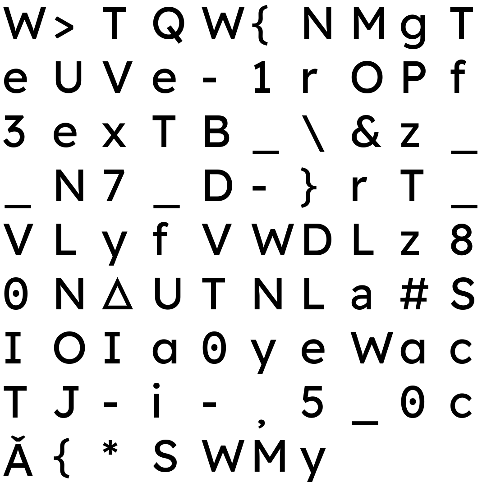
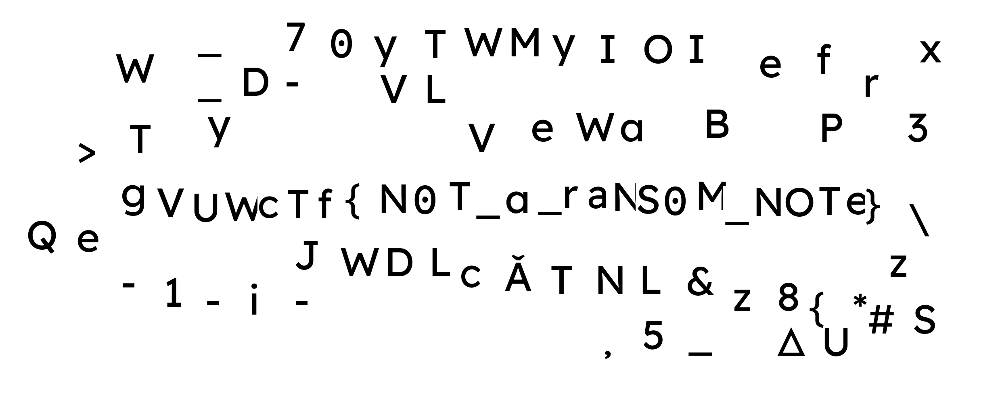

# copland-opportunity — Forensics Writeup

**Category:** Forensics
**Challenge name:** copland-opportunity
**Prompt:** *"Can you recover my special folder?"*
**Provided file:** `disk-folders-removed.img` (30.5 MiB, HFS+ filesystem image)
**Flag:** `VuwCTF{N0T_a_raNS0M_NOTe}`

---

## Table of Contents

1. [TL;DR](#tldr)
2. [Tools Used](#tools-used)
3. [Part 1 — Initial Triage](#part-1--initial-triage)
4. [Part 2 — Sleuth Kit Refuses to Open the Volume](#part-2--sleuth-kit-refuses-to-open-the-volume)
5. [Part 3 — Reading the Volume Header by Hand](#part-3--reading-the-volume-header-by-hand)
6. [Part 4 — Mapping the Allocation Bitmap and the Live Data](#part-4--mapping-the-allocation-bitmap-and-the-live-data)
7. [Part 5 — Hand-Parsing the Catalog B-Tree](#part-5--hand-parsing-the-catalog-b-tree)
8. [Part 6 — What "folders removed" Actually Means](#part-6--what-folders-removed-actually-means)
9. [Part 7 — Extracting the 91 Files](#part-7--extracting-the-91-files)
10. [Part 8 — 87 Glyphs and No Order](#part-8--87-glyphs-and-no-order)
11. [Part 9 — Chasing the Wrong Leads](#part-9--chasing-the-wrong-leads)
12. [Part 10 — The Orphaned `.DS_Store`](#part-10--the-orphaned-dsstore)
13. [Part 11 — The Live `.DS_Store` and the `Iloc` Records](#part-11--the-live-dsstore-and-the-iloc-records)
14. [Part 12 — Recomposing the Folder Window](#part-12--recomposing-the-folder-window)
15. [Part 13 — Separating Signal From Decoys](#part-13--separating-signal-from-decoys)
16. [Part 14 — Reading the Flag (and the `0` vs `O` Trap)](#part-14--reading-the-flag-and-the-0-vs-o-trap)
17. [Appendix A — Full Solve Script](#appendix-a--full-solve-script)
18. [Appendix B — HFS+ Structures Cheat Sheet](#appendix-b--hfs-structures-cheat-sheet)
19. [Appendix C — `.DS_Store` (Bud1) Format Cheat Sheet](#appendix-c--ds_store-bud1-format-cheat-sheet)
20. [Key Takeaways](#key-takeaways)
21. [Comparison With `coopland-spirit`](#comparison-with-coopland-spirit)

---

## TL;DR

`disk-folders-removed.img` is an HFS+ volume that **no standard tool will open**. Every Sleuth Kit command
dies instantly with `hfs_cat_file_lookup: thread for file (2)` — the catalog record for the root directory
is gone. That is the "folders removed" in the filename: every `kHFSPlusFolderRecord` in the catalog B-tree,
including the root's, has been deleted. The file records survived.

Parsing the catalog B-tree by hand recovers 91 live files: **87 tiny PNGs with random hex names**, a
`.DS_Store`, an `fseventsd-uuid`, and two FSEvents logs. Each PNG is a single rendered **character** —
`V`, `{`, `0`, `_`, and so on. Flat, alphabetically-named, no directory structure left to tell you what
order they go in.

The order is in the `.DS_Store`. macOS stores per-file **Finder icon coordinates** in `Iloc` records inside
that file, and all 87 PNGs have one. Compositing each glyph onto a blank canvas at its recorded `(x, y)`
reproduces the exact Finder window the author arranged — a scatter of decoy letters with one horizontal
band of 25 glyphs spelling the flag in ransom-note style:

```
VuwCTF{N0T_a_raNS0M_NOTe}
```

---

## Tools Used

| Tool | Purpose |
|---|---|
| `file`, `xxd`, `strings` | Identification and hex/text inspection |
| The Sleuth Kit (`fsstat`, `fls`, `istat`, `icat`) | Attempted — **fails on this image**, see [Part 2](#part-2--sleuth-kit-refuses-to-open-the-volume) |
| Python 3 (`struct`) | Hand-written HFS+ volume header / allocation bitmap / catalog B-tree / attributes B-tree parsers |
| Python 3 (`struct`) | Hand-written `.DS_Store` (Bud1 buddy-allocator + B-tree) parser |
| Python 3 (`PIL`/Pillow, `numpy`) | Glyph compositing, ink bounding-box measurement, baseline analysis |
| `gzip` | Decompressing the FSEvents streams |

The interesting property of this challenge is that the *entire* filesystem layer has to be re-implemented.
Unlike `coopland-spirit`, where TSK did the parsing and the work was in locating orphaned blocks, here TSK
never gets off the ground.

---

## Part 1 — Initial Triage

```bash
$ file disk-folders-removed.img
disk-folders-removed.img: Apple HFS Plus version 4 data (mounted) last mounted by: '10.0',
created: Wed Jul 29 04:50:25 2026, last modified: Tue Jul 28 11:57:14 2026,
last checked: Tue Jul 28 11:50:25 2026, block size: 4096, number of blocks: 7813,
free blocks: 7534
```

Numbers to keep:

- **Block size:** 4096
- **Total blocks:** 7813 → `7813 × 4096 = 32,002,048` bytes, which is *exactly* the image size (no truncation
  this time, unlike `coopland-spirit`)
- **Free blocks:** 7534 → only **279 blocks (1.1 MiB) allocated**

That last number is the first real signal. The `coopland-spirit` image was nearly full of a real `glfw`
checkout used as camouflage. This one is 99% empty. There is no haystack — whatever is here is the needle.

The distributed archive also contains the usual macOS `__MACOSX/._disk-folders-removed.img` AppleDouble
stub. It is 276 bytes of resource-fork/Finder-info boilerplate and contains nothing useful.

---

## Part 2 — Sleuth Kit Refuses to Open the Volume

```bash
$ fsstat disk-folders-removed.img
General file system error (hfs_cat_traverse: length of key 0 in leaf node 6 out of bounds
 (6 < 2 < 4096)) ( hfs_cat_file_lookup: thread for file (2))
FILE SYSTEM INFORMATION
--------------------------------------------
File System Type: HFS+
File System Version: HFS+

Volume Name:
```

```bash
$ fls -r -p disk-folders-removed.img
General file system error (hfs_cat_traverse: length of key 0 in leaf node 6 out of bounds
 (6 < 2 < 4096)) ( hfs_cat_file_lookup: thread for file (2)  - hfs_dir_open_meta)
```

`tsk_recover`, `istat`, `icat` on the catalog — all the same. The error is precise and worth reading
carefully:

- **`thread for file (2)`** — CNID 2 is the HFS+ **root directory**. TSK is trying to look up the root's
  *thread record* (the record that maps a CNID back to its name and parent) so it can start walking the
  tree, and cannot find it.
- **`length of key 0 in leaf node 6`** — while searching it walked off the end of the live records in leaf
  node 6 and read a zeroed key.

So the catalog B-tree is structurally intact enough that TSK can find and enter leaf node 6, but the record
it needs is missing. Everything TSK does starts at the root, so the whole toolchain is dead. `mmls` also
confirms there is no partition table — this is a bare filesystem, so there is no alternate volume to try.

**The image is not corrupt in a way that damaged data.** It is corrupt in a way that removed *metadata*,
which is exactly what "folders removed" in the filename advertises. Everything from here is hand-rolled.

---

## Part 3 — Reading the Volume Header by Hand

The HFS+ volume header lives at a fixed offset — byte 1024 — and is never moved, so it survives anything
done to the B-trees.

```bash
$ xxd -l 256 -s 1024 disk-folders-removed.img
00000400: 482b 0004 8000 0100 3130 2e30 0000 0000  H+......10.0....
00000410: e68e f0c1 e68e 499a 0000 0000 e68e 4801  ......I.......H.
00000420: 0000 005b 0000 0003 0000 1000 0000 1e85  ...[............
00000430: 0000 1d6e 0000 05d1 0001 0000 0001 0000  ...n............
...
```

```python
import struct
d  = open('disk-folders-removed.img', 'rb').read()
vh = d[1024:1024+512]

blockSize, totalBlocks, freeBlocks = struct.unpack_from('>III', vh, 40)
# 4096, 7813, 7534

# the five special-file forks are 80-byte HFSPlusForkData records starting at offset 112
off = 112
for name in ['allocationFile','extentsFile','catalogFile','attributesFile','startupFile']:
    logicalSize, clump, totalBlks = struct.unpack_from('>QII', vh, off)
    extents = [struct.unpack_from('>II', vh, off+16+i*8) for i in range(8)]
    print(name, logicalSize, totalBlks, [e for e in extents if e[1]])
    off += 80
```

```
allocationFile   4096    1   [(1, 1)]
extentsFile    249856   61   [(2, 61)]
catalogFile    249856   61   [(723, 61)]
attributesFile 245760   60   [(63, 60)]
startupFile         0    0   []
```

Now we know where everything is without asking TSK for anything:

| Special file | CNID | Blocks | Byte offset |
|---|---|---|---|
| Allocation bitmap | 6 | `1` (1 block) | `0x1000` |
| Extents overflow | 3 | `2–62` (61 blocks) | `0x2000` |
| **Catalog** | 4 | **`723–783`** (61 blocks) | **`0x2D3000`** |
| Attributes | 8 | `63–122` (60 blocks) | `0x3F000` |

---

## Part 4 — Mapping the Allocation Bitmap and the Live Data

The bitmap is one block, one bit per allocation block, MSB-first, `1` = allocated.

```python
alloc = d[1*4096 : 2*4096]
def is_allocated(b):
    return (alloc[b // 8] >> (7 - b % 8)) & 1
```

Grouping into runs:

```
ALLOC   0 – 122     (123 blocks)   boot blocks, volume header, allocation file, extents, attributes
free  123 – 722     (600 blocks)
ALLOC 723 – 783     ( 61 blocks)   catalog file
free  784 – 1393    (610 blocks)
ALLOC 1394          (  1 block )
free  1395 – 1396   (  2 blocks)   <-- note this
ALLOC 1397 – 1489   ( 93 blocks)
free  1490 – 7811   (6322 blocks)
ALLOC 7812          (  1 block )   alternate (backup) volume header
```

Total allocated = 279 ✓ (matches the volume header exactly).

Separately, scanning for **blocks that are not entirely zero** — i.e. where content actually exists,
regardless of what the bitmap claims — gives:

```
DATA   0 –    2   (3)     boot / volume header
zero   3 –   62   (60)    extents overflow file: completely empty
DATA  63 –   70   (8)     attributes B-tree (header + 87 records)
zero  71 –  722   (652)
DATA 723 –  734   (12)    catalog B-tree (12 of 61 nodes in use)
zero 735 – 1393   (659)
DATA 1394 – 1489  (96)    <-- all user file content
zero 1490 – 7811  (6322)
DATA 7812 – 7812  (1)     alternate volume header
```

Cross-referencing the two maps produces the single most important observation of the whole challenge:

> **Blocks 1395 and 1396 are marked FREE in the allocation bitmap, but they are not zero.**

That is a deleted file. Two blocks, 8 KiB, sitting in the middle of the live data region. Park that for
[Part 10](#part-10--the-orphaned-dsstore).

The extents overflow file being entirely zero is also useful: it means **no file on this volume is
fragmented beyond its 8 inline catalog extents**, so every file's extent list is fully recoverable from
the catalog alone.

---

## Part 5 — Hand-Parsing the Catalog B-Tree

The catalog occupies blocks 723–783, i.e. `img[723*4096 : 784*4096]`. Node 0 of any HFS+ B-tree is the
header node: a 14-byte `BTNodeDescriptor` followed by a `BTHeaderRec`.

```python
cat = d[723*4096 : 784*4096]
(treeDepth, rootNode, leafRecords, firstLeaf, lastLeaf,
 nodeSize, maxKeyLen, totalNodes, freeNodes) = struct.unpack_from('>HIIIIHHII', cat, 14)
```

```
treeDepth   2
rootNode    3
leafRecords 190
firstLeaf   6
lastLeaf    1
nodeSize    4096
totalNodes  61
freeNodes   49
```

61 total nodes, 49 free → **12 nodes in use**, which matches the 12 non-zero blocks (723–734) found in
Part 4 exactly. Nothing is hiding in unused catalog nodes.

Rather than walking the tree from `rootNode` (which is what TSK does, and what fails), the robust approach
against a damaged tree is to **brute-force every node** and harvest every leaf record it contains:

```python
NS = 4096
for n in range(61):
    node = cat[n*NS : (n+1)*NS]
    fLink, bLink, kind, height, numRecs, _ = struct.unpack_from('>IIbbHH', node, 0)
    if kind != -1:            # -1 = kBTLeafNode; skip index/header/map nodes
        continue
    # record offsets are stored as u16s growing backwards from the end of the node
    offs = [struct.unpack_from('>H', node, NS - 2*(i+1))[0] for i in range(numRecs+1)]
    for i in range(numRecs):
        rec = node[offs[i] : offs[i+1]]
        keyLen   = struct.unpack_from('>H', rec, 0)[0]
        parentID = struct.unpack_from('>I', rec, 2)[0]
        nameLen  = struct.unpack_from('>H', rec, 6)[0]
        name     = rec[8 : 8+nameLen*2].decode('utf-16-be')
        ro = 2 + keyLen
        ro += ro % 2                      # records are 2-byte aligned
        recordType = struct.unpack_from('>h', rec, ro)[0]
        ...
```

This recovers all **190** leaf records that the header promised — the tree is complete, it is only the
*contents* that were tampered with.

Breaking the 190 down by `recordType`:

| `recordType` | Meaning | Count |
|---|---|---|
| `1` — `kHFSPlusFolderRecord` | **directory** | **0** |
| `2` — `kHFSPlusFileRecord` | file | 91 |
| `3` — `kHFSPlusFolderThreadRecord` | folder thread | 4 |
| `4` — `kHFSPlusFileThreadRecord` | file thread | 95 |

---

## Part 6 — What "folders removed" Actually Means

**Zero folder records. Ninety-one file records.** Every `kHFSPlusFolderRecord` on the volume was surgically
deleted from the catalog, and only those.

The four surviving *folder thread* records (recordType 3) are the receipts. A thread record maps a CNID back
to `(parentID, name)`, and it is keyed by the CNID alone:

```
CNID  2  → parent   1, name "magic-disk"                            <- the volume root
CNID 16  → parent   2, name "\x00\x00\x00\x00HFS+ Private Data"     <- hard-link store
CNID 17  → parent   2, name ".HFS+ Private Directory Data\r"        <- directory hard-link store
CNID 18  → parent   2, name ".fseventsd"                            <- FSEvents log directory
```

So the volume is called `magic-disk` (same generator as `coopland-spirit`), and there were four directories:
the root, the two standard HFS+ private directories, and `.fseventsd`. Their *names* survive in the thread
records; their *folder records* — the entries that carry valence, timestamps, and the CNID→directory
binding the tree is indexed by — are gone.

This is precisely why TSK dies: `hfs_cat_file_lookup(2)` searches the catalog for the root's key and finds
no matching folder record, so it cannot begin a traversal.

The parentage of the 91 files, read straight from the catalog keys:

| Parent CNID | Directory | Files |
|---|---|---|
| 2 | `/` (root) | 88 |
| 18 | `/.fseventsd` | 3 |

Nothing is orphaned. There is no third directory whose files were re-parented. The **"special folder" of
the prompt is the root directory itself** — the folder whose *layout* was destroyed along with its record.

*(For completeness: CNIDs 3–15 are absent from the catalog, but that is normal — they are the reserved
special-file CNIDs, which live in the volume header rather than as catalog entries.)*

---

## Part 7 — Extracting the 91 Files

With the catalog parsed, extraction is direct. Each `HFSPlusCatalogFile` record carries the data fork's
`logicalSize` and up to 8 extents inline at offset `+88` from the start of the record:

```python
def parse_fork(rec, o):
    logicalSize, clumpSize, totalBlocks = struct.unpack_from('>QII', rec, o)
    extents = [struct.unpack_from('>II', rec, o+16+i*8) for i in range(8)]
    return logicalSize, [e for e in extents if e[1]]

logicalSize, extents = parse_fork(rec, ro + 88)          # data fork
content = b''.join(d[s*4096 : (s+c)*4096] for s, c in extents)[:logicalSize]
```

Every file has exactly one extent and every one is intact. The recovered tree:

```
/                                   (CNID 2, "magic-disk")
├── .DS_Store                       14340 bytes   blocks 1484–1487
├── 010d010ad8795f9b.png             1735 bytes   block 1477
├── 015a2503d60cc5c7.png             1454 bytes   block 1426
├── ... 87 PNGs total, blocks 1397–1483 ...
└── .fseventsd/                     (CNID 18)
    ├── fseventsd-uuid                 36 bytes   block 1394
    ├── 000000000044196a             1562 bytes   block 1488
    └── 000000000044196b               70 bytes   block 1489
```

That accounts for every non-zero block in the 1394–1489 data region **except 1395–1396** — the deleted
two-block file from Part 4.

```bash
$ file out/*.png | head -3
out/010d010ad8795f9b.png: PNG image data, 49 x 101, 8-bit colormap, non-interlaced
out/015a2503d60cc5c7.png: PNG image data, 70 x 101, 8-bit colormap, non-interlaced
out/02726403c973a9ba.png: PNG image data, 72 x 101, 8-bit colormap, non-interlaced
```

---

## Part 8 — 87 Glyphs and No Order

Every PNG is tiny — 25–101 px wide, 101–110 px tall, 8-bit colormap, one ink colour (pure black) on white.
Rendering one as ASCII art immediately explains what they are:

```
..########......
..############..
.........####...
........####....
......####......
.....####.......
...####.........
..############..
..############..
```

That is the digit **2**. Each PNG is a **single rendered character**.

Laying all 87 out in CNID order gives a bag of letters, digits, and punctuation with no meaning:


*`W > T Q W { N M g T e U V e - 1 r O P f 3 e x T B _ \ & z _ _ N 7 _ D - } r T _ V L y f V W D L z 8 0 N △ U T N L a # S I O I a 0 y e W a c T J - i - , 5 _ 0 c Ă { * S W M y`*

The filenames are random 16-hex-digit strings, so alphabetical order is meaningless. The challenge is now
sharply defined:

> **87 characters. The ordering information was in the folder. The folder is gone. Find where the order
> was really stored.**

A useful structural detail while we are here — deduplicating the 87 files by MD5 leaves only a few dozen
distinct images (22 groups have 2–6 identical members). The generator has **one canonical PNG per distinct
character** and reuses it, so identical characters are byte-identical files. This becomes important in
[Part 13](#part-13--separating-signal-from-decoys).

---

## Part 9 — Chasing the Wrong Leads

Before landing on the right artifact, the obvious ordering channels all had to be ruled out. All of them
are dead ends, and each one is worth a line because they are exactly what you would reach for:

**Catalog CNIDs / allocation blocks.** Files were written in alphabetical-by-filename order — CNID 21 is
`0bd107ad72ffcc84.png` at block 1397, CNID 22 is `0d3cc3feea51a56f.png` at block 1398, and so on in lockstep.
Since the filenames are random hex, this ordering is random. Confirmed: reading the glyphs in CNID order
produces the gibberish shown above.

**Timestamps.** All 87 PNGs share one of only **five** distinct creation timestamps and **three** distinct
modification timestamps, in blocks of ~20 files. Far too coarse to order 87 items.

**Finder icon position in the catalog record.** HFS+ file records carry a 16-byte `FndrFileInfo` containing
`fdLocation` (a `Point` — the icon's coordinates). This is the classic place for exactly this trick, so it
was the first thing checked:

```
fdType = 0x00000000   fdCreator = 0x00000000   fdFlags = 0   fdLocation = (0, 0)
```

**All 87 are zero.** One distinct value across every file. Dead end — but a very deliberate-feeling one,
because it points straight at the idea of *icon positions* while refusing to hand them over.

**Extended attributes.** The attributes B-tree (blocks 63–122) has a suspiciously perfect **87 leaf
records** — exactly one per PNG. Parsing it:

```python
# HFSPlusAttrKey: u16 keyLength, u16 pad, u32 fileID, u32 startBlock,
#                 u16 attrNameLen, u16 attrName[] (UTF-16BE)
# then u32 recordType (0x10 = inline data), u32 reserved[2], u32 attrSize, u8 data[]
```

```
(53, 'com.apple.quarantine', b'0081;6a687f11;Firefox;615EC273-14F5-4159-ADF7-BD4558A5C9F9')
(54, 'com.apple.quarantine', b'0081;6a687f11;Firefox;615EC273-14F5-4159-ADF7-BD4558A5C9F9')
...
```

87 records, all `com.apple.quarantine`, **all byte-identical**. Pure flavour text (it makes the PNGs look
like they were downloaded from the web). Zero ordering information.

**FSEvents logs.** Both `.fseventsd` streams gzip-decompress into valid `SLD`-format event streams:

```python
import gzip
d = gzip.decompress(open('out/000000000044196a', 'rb').read())
```

```
2SLDQc...
  .DS_Store
  010d010ad8795f9b.png
  015a2503d60cc5c7.png
  ...  (all 87, plus .DS_Store)
000000000044196b → 1SLD ... .fseventsd/sl-compat
```

The paths are **flat** — `010d010ad8795f9b.png`, not `something/010d010ad8795f9b.png`. This independently
confirms Part 6: the PNGs really did live in the root directory and were never in a subfolder that got
deleted. The events are in alphabetical order, which is again random. No ordering, but a valuable negative
result: **stop looking for a missing subdirectory.**

**Volume-wide string search.** `strings -e b` (UTF-16BE) over the whole image returns only the 87 filenames,
the two FSEvents log names, and the standard HFS+ private-directory names. No hidden folder name, no
instructions, no second flag.

Every catalog-side, metadata-side, and log-side channel is empty. The only unexamined artifact left is the
deleted file at blocks 1395–1396.

---

## Part 10 — The Orphaned `.DS_Store`

```bash
$ xxd -s $((1395*4096)) -l 64 disk-folders-removed.img
00573000: 0000 0001 4275 6431 0000 1000 0000 0800  ....Bud1........
00573010: 0000 1000 0000 0108 0000 0000 0000 0000  ................
```

`Bud1` — the magic of a macOS **`.DS_Store`** file. This is the deleted file the bitmap gave away in Part 4:
no catalog record points at it, and its blocks are marked free, but the content is fully intact.

`.DS_Store` is *the* macOS artifact for recording how a Finder window is arranged: window geometry, view
mode, sort order, and per-item icon coordinates. For a challenge whose prompt is "recover my special
**folder**", a deleted `.DS_Store` is not a coincidence — the folder's *appearance* is the thing that was
removed.

Parsing it (format in [Appendix C](#appendix-c--ds_store-bud1-format-cheat-sheet)) yields just two records:

```
.   bwsp   blob   bplist00 ... ShowStatusBar / ShowToolbar / ShowTabView /
                  ContainerShowSidebar / WindowBounds "{{367, 59}, {835, 716}}" / ShowSidebar
.   vSrn   long   1
```

Window geometry and sidebar flags for the folder itself (`.`), and nothing else. This is an **older
generation** of the root `.DS_Store` — written when the window was first opened, before any icons were
positioned. When Finder later rewrote the file with icon positions it grew from 2 blocks to 4, could not be
extended in place, and was reallocated elsewhere, leaving this stale copy behind as an unlinked orphan.

Disappointing on its own — but it names the mechanism. If the *old* `.DS_Store` has window state, the
**live** one must have the icons.

---

## Part 11 — The Live `.DS_Store` and the `Iloc` Records

The live `/.DS_Store` (CNID 20, 14340 bytes, blocks 1484–1487) was already extracted in Part 7. Its
buddy-allocator header points at a `DSDB` directory entry whose B-tree reports:

```
rootNode = 3   levels = 1   records = 89   nodes = 3   pageSize = 4096
```

**89 records.** Two are the `.` window-state records carried over from the old file. The other **87** are
one per PNG:

```
010d010ad8795f9b.png   Iloc   blob   x=2202  y=606
015a2503d60cc5c7.png   Iloc   blob   x=1175  y=446
02726403c973a9ba.png   Iloc   blob   x=1925  y=803
02c4108cef776289.png   Iloc   blob   x= 555  y=467
05a445267675a3ee.png   Iloc   blob   x= 299  y=656
0bd107ad72ffcc84.png   Iloc   blob   x= 285  y=124
...
ff234391670c6d26.png   Iloc   blob   x=1368  y= 59
```

`Iloc` is the Finder **icon location** record: a 16-byte blob whose first two big-endian `u32`s are the
icon's x and y coordinates within the folder window, followed by `0xFFFF FFFF FFFF 0000` filler.

```python
x, y = struct.unpack_from('>II', blob, 0)
```

This is the ordering channel. The author deleted the folder records so the directory could not be
enumerated, zeroed `fdLocation` in every catalog record so the obvious icon-position field would be empty,
and left the *real* positions in the `.DS_Store` — an artifact that only exists because Finder wrote it,
and that no filesystem-level recovery tool interprets.

---

## Part 12 — Recomposing the Folder Window

Paste each glyph PNG onto a white canvas at its recorded `(x, y)`:

```python
from PIL import Image
canvas = Image.new('RGB', (2478, 1003), 'white')
for name, x, y in ilocs:
    im = Image.open(f'out/{name}').convert('RGBA')
    canvas.paste(im, (x, y), im)
canvas.save('canvas_full.png')
```



There it is: the folder as its owner last saw it. Scattered letters everywhere, and running across the
middle, one clean horizontal band of characters that is unmistakably a flag.

---

## Part 13 — Separating Signal From Decoys

The band needs to be isolated cleanly, because two decoys sit close enough to it to be swept up by a naive
crop. Plotting the y-coordinate of all 87 icons makes the structure obvious:

```
y =  45,  45,  59,  59,  59,  62,  62,  63,  74,  76,  76,  76, 102, 111, 124,
    157, 157, 157, 159, 175, 175, 261, 262, 270, 270, 270, 271, 271, 296, 299, 324,   <- 31 decoys above
    432, 435, 436, 437, 440, 441, 443, 446, 447, 448, 449, 449, 450, 451, 453,
    453, 455, 456, 457, 460, 460, 461, 462, 462, 467, 470,                            <- 26 in the band
    495, 538, 544, 588, 605, 605, 605, 606, 632, 632, 649, 649, 649, 652, 656,
    681, 691, 691, 700, 700, 700, 718, 718, 747, 747, 786, 786, 786, 803, 803         <- 30 decoys below
```

There is a hard gap: **no icon at all between y=324 and y=432**, and none between y=470 and y=495. The
message occupies a tight `y ∈ [432, 470]` band (jitter of ±19 px around a baseline, deliberate ransom-note
raggedness) and the decoy placement clearly avoided colliding with it.

That leaves 26 glyphs in the band — one more than the 25 characters of the flag. Sorting them by x and
measuring the ink bounding box of each:

```
x=  299  inkL= 303  inkR= 356  gap=  —   'g'   <-- suspect
x=  387  inkL= 390  inkR= 455  gap= 34   'V'
x=  473  inkL= 482  inkR= 537  gap= 27   'U'
x=  555  inkL= 558  inkR= 651  gap= 21   'W'
x=  638  inkL= 642  inkR= 688  gap= -9   'c'
...
x= 2144  inkL=2147  inkR=2180  gap= -2   '}'
x= 2248  inkL=2253  inkR=2301  gap= 73   '\'  <-- suspect
```

Two candidates for exclusion, one at each end. The `\` at x=2248 is easy: its 73 px gap is far outside the
in-message range (−9 to 56), and its y=495 sits in the decoy zone below the band. Gone.

The leading `g` at x=299 is the subtle one — its 34 px gap is unremarkable and its y=432 is inside the band.
Three independent arguments settle it:

1. **It is outside the message's horizontal extent.** The message spans x ∈ [387, 2186]. A decoy placed at
   x ∈ [299, 365] does not overlap any message glyph, so a collision-avoiding random placement is perfectly
   free to put it there — exactly as it did with the `\` in the free margin on the right. The "decoys avoid
   the band" rule is really "decoys avoid *overlapping glyphs*", and both suspects sit in the empty margins
   at the two ends of the line.
2. **Its baseline is an outlier.** `g` is a descender glyph: ink top 459, bottom 535, height 76 = x-height
   (54, same as the `c` and `a` in the message) plus ~22 px of descender, putting its baseline at ~513. The
   25 message glyphs have baselines in [515, 557], mean ≈ 532, σ ≈ 9. The `g` sits ~2σ below the whole
   distribution.
3. **`gVUWcTf{` is not a flag prefix; `VUWcTf{` is.** Six glyphs matching `v-u-w-c-t-f` immediately
   followed by `{` is the challenge's flag format. A 26th character in front of it is noise.

A note on the casing, because it looks wrong at first glance and matters for what you type into the
scoreboard. The rendered prefix is `VUWcTf`, not `VuwCTF`. This is a property of the generator, not of the
flag: as noted in Part 8, there is exactly **one canonical PNG per character**, and across all 87 glyphs
**no letter ever appears in both cases**. The full inventory is `a c e f g i r x y z` (lowercase) and
`B D I J L M N O P Q S T U V W` (uppercase) — 24 distinct letters, each locked to a single randomly-chosen
case. All three `T`s in the message are the same file; all four `N`s are the same file. The glyph library is
keyed case-insensitively, so **the rendered case carries no information** — read the message
case-insensitively and write the flag in the challenge's canonical casing.

---

## Part 14 — Reading the Flag (and the `0` vs `O` Trap)

Compositing only the 25 message glyphs, sorted by x, on their own strip:


```
V U W c T f { N 0 T _ a _ r a N S 0 M _ N O T e }
```

One character needs care. The message contains three round glyphs, and they are **not** the same character:


| Position | File | Width | Glyph |
|---|---|---|---|
| `N`**`0`**`T` | `96889d19529158f7.png` | 62 px | narrow, **dot in the counter** → digit `0` |
| `raNS`**`0`**`M` | `e21681487cc3802a.png` | 62 px | narrow, **dot in the counter** → digit `0` |
| `N`**`O`**`Te` | `6ace3d8329abe94a.png` | **79 px** | wide, round, **empty counter** → letter `O` |

The font is a "slashed/dotted zero" typeface, so the digit is unambiguous once you look: the first two are
62 px wide with a dot, the third is 79 px wide and open. The tail is `NOTe`, **not** `N0Te`. Reading the
byte-level dedup confirms it — `6ace3d8329abe94a.png` is not byte-identical to either zero file, and it *is*
byte-identical to the `O` glyphs elsewhere in the decoy scatter.

Normalising the case (Part 13) and keeping the leetspeak digits:

```
VuwCTF{N0T_a_raNS0M_NOTe}
```

Which reads, appropriately for a page of cut-out ransom-note letters: **"not a ransom note."**

---

## Appendix A — Full Solve Script

Everything above, condensed into one reproducible script. Assumes `disk-folders-removed.img` in the working
directory; requires only Pillow.

```python
#!/usr/bin/env python3
"""copland-opportunity — full solve.

HFS+ volume with every folder record deleted from the catalog B-tree (so TSK cannot
traverse it). Recovers the file records by hand, extracts 87 single-character PNGs,
then recovers their arrangement from the .DS_Store Iloc (Finder icon location) records.
"""
import struct
from PIL import Image

IMG = 'disk-folders-removed.img'
d   = open(IMG, 'rb').read()

# ---------------------------------------------------------------- volume header
vh = d[1024:1024+512]
assert vh[:2] == b'H+'
BS, TOTAL_BLOCKS, FREE_BLOCKS = struct.unpack_from('>III', vh, 40)

def fork(buf, o):
    """HFSPlusForkData -> (logicalSize, [(startBlock, blockCount), ...])"""
    logical, _clump, _tot = struct.unpack_from('>QII', buf, o)
    ext = [struct.unpack_from('>II', buf, o + 16 + i*8) for i in range(8)]
    return logical, [e for e in ext if e[1]]

_, CATALOG_EXT = fork(vh, 112 + 80*2)          # allocation, extents, [catalog]

# ---------------------------------------------------------------- catalog B-tree
cat = b''.join(d[s*BS:(s+c)*BS] for s, c in CATALOG_EXT)
NS  = struct.unpack_from('>H', cat, 14 + 18)[0]          # BTHeaderRec.nodeSize

files = {}                                                # name -> (size, extents)
for n in range(len(cat) // NS):
    node = cat[n*NS:(n+1)*NS]
    _fl, _bl, kind, _h, numRecs, _r = struct.unpack_from('>IIbbHH', node, 0)
    if kind != -1 or not 0 < numRecs < 1000:              # -1 == kBTLeafNode
        continue
    offs = [struct.unpack_from('>H', node, NS - 2*(i+1))[0] for i in range(numRecs+1)]
    for i in range(numRecs):
        rec = node[offs[i]:offs[i+1]]
        if len(rec) < 10:
            continue
        keyLen  = struct.unpack_from('>H', rec, 0)[0]
        nameLen = struct.unpack_from('>H', rec, 6)[0]
        name    = rec[8:8+nameLen*2].decode('utf-16-be', 'replace')
        ro = 2 + keyLen
        ro += ro % 2
        if ro + 2 > len(rec) or struct.unpack_from('>h', rec, ro)[0] != 2:
            continue                                      # 2 == kHFSPlusFileRecord
        files[name] = fork(rec, ro + 88)                  # data fork

def read(name):
    size, ext = files[name]
    return b''.join(d[s*BS:(s+c)*BS] for s, c in ext)[:size]

# ---------------------------------------------------------------- .DS_Store (Bud1)
def ds_records(buf):
    assert buf[4:8] == b'Bud1'
    aoff, _asize, _copy = struct.unpack_from('>III', buf, 8)
    a = aoff + 4
    nblocks = struct.unpack_from('>I', buf, a)[0]
    addrs   = [struct.unpack_from('>I', buf, a + 8 + 4*i)[0] for i in range(nblocks)]
    p = a + 8 + 4*256                                     # skip the 256-slot offset table
    ndir = struct.unpack_from('>I', buf, p)[0]; p += 4
    dirs = {}
    for _ in range(ndir):
        nl = buf[p]; p += 1
        key = buf[p:p+nl].decode(); p += nl
        dirs[key] = struct.unpack_from('>I', buf, p)[0]; p += 4

    def block(bid):
        v = addrs[bid]
        return (v & ~0x1f) + 4                            # low 5 bits encode log2(size)

    out = []

    def record(p):
        nl = struct.unpack_from('>I', buf, p)[0]; p += 4
        name = buf[p:p+nl*2].decode('utf-16-be'); p += nl*2
        sid  = buf[p:p+4].decode('latin1'); p += 4
        typ  = buf[p:p+4].decode('latin1'); p += 4
        if   typ == 'bool':            val = buf[p]; p += 1
        elif typ in ('long', 'shor'):  val = struct.unpack_from('>I', buf, p)[0]; p += 4
        elif typ in ('comp', 'dutc'):  val = struct.unpack_from('>Q', buf, p)[0]; p += 8
        elif typ == 'type':            val = buf[p:p+4]; p += 4
        elif typ == 'blob':
            n = struct.unpack_from('>I', buf, p)[0]; p += 4
            val = buf[p:p+n]; p += n
        elif typ == 'ustr':
            n = struct.unpack_from('>I', buf, p)[0]; p += 4
            val = buf[p:p+n*2].decode('utf-16-be'); p += n*2
        else:
            raise ValueError('unknown .DS_Store type ' + typ)
        return p, (name, sid, typ, val)

    def node(bid):
        o = block(bid)
        P, count = struct.unpack_from('>II', buf, o)
        p = o + 8
        if P == 0:                                        # leaf
            for _ in range(count):
                p, r = record(p); out.append(r)
        else:                                             # internal: child, rec, child, ...
            for _ in range(count):
                child = struct.unpack_from('>I', buf, p)[0]; p += 4
                node(child)
                p, r = record(p); out.append(r)
            node(P)

    root, _levels, _nrec, _nnodes, _pagesize = struct.unpack_from('>IIIII', buf, block(dirs['DSDB']))
    node(root)
    return out

ilocs = []
for name, sid, typ, val in ds_records(read('.DS_Store')):
    if sid == 'Iloc' and typ == 'blob':
        x, y = struct.unpack_from('>II', val, 0)
        ilocs.append((name, x, y))
assert len(ilocs) == 87

# ---------------------------------------------------------------- recompose
import io
glyph = {n: Image.open(io.BytesIO(read(n))).convert('RGBA') for n, _, _ in ilocs}

W = max(x for _, x, _ in ilocs) + 200
H = max(y for _, _, y in ilocs) + 200
canvas = Image.new('RGB', (W, H), 'white')
for n, x, y in ilocs:
    canvas.paste(glyph[n], (x, y), glyph[n])
canvas.save('canvas_full.png')

# ---------------------------------------------------------------- isolate the message
# The flag row is the tight y-band 430..475; the two decoys that share it sit outside
# the message's horizontal extent (x < 380 and x > 2200).
row = sorted((r for r in ilocs if 430 <= r[2] <= 475 and 380 <= r[1] <= 2200),
             key=lambda r: r[1])
assert len(row) == 25

x0 = min(x for _, x, _ in row)
y0 = min(y for _, _, y in row)
strip = Image.new('RGB', (max(x for _, x, _ in row) - x0 + 150, 125), 'white')
for n, x, y in row:
    strip.paste(glyph[n], (x - x0, y - y0), glyph[n])
strip.save('flag_row.png')

print('wrote canvas_full.png and flag_row.png')
print('flag_row.png reads: VUWcTf{N0T_a_raNS0M_NOTe}')
print('glyph case is randomised per character by the generator -> normalise it:')
print('FLAG: VuwCTF{N0T_a_raNS0M_NOTe}')
```

---

## Appendix B — HFS+ Structures Cheat Sheet

All fields big-endian, per Apple's `hfs_format.h`.

**`HFSPlusVolumeHeader`** (at byte offset **1024**, always):
```
u16  signature            'H+' (0x482B)
u16  version              4
u32  attributes
u32  lastMountedVersion
u32  journalInfoBlock
u32  createDate / modifyDate / backupDate / checkedDate
u32  fileCount
u32  folderCount
u32  blockSize                    <- offset 40
u32  totalBlocks                  <- offset 44
u32  freeBlocks                   <- offset 48
...
     HFSPlusForkData allocationFile   <- offset 112
     HFSPlusForkData extentsFile      <- offset 192
     HFSPlusForkData catalogFile      <- offset 272
     HFSPlusForkData attributesFile   <- offset 352
     HFSPlusForkData startupFile      <- offset 432
```

**`BTNodeDescriptor`** (first 14 bytes of every B-tree node):
```
u32  fLink        next node
u32  bLink        previous node
i8   kind         0 = leaf(*), 1 = index, 2 = header, 3 = map
i8   height
u16  numRecords
u16  reserved
```
*(\* Sleuth Kit and Apple's headers use `kBTLeafNode = -1`; the byte value is `0xFF`.)*

**`BTHeaderRec`** (immediately after the descriptor in node 0):
```
u16  treeDepth
u32  rootNode
u32  leafRecords
u32  firstLeafNode
u32  lastLeafNode
u16  nodeSize
u16  maxKeyLength
u32  totalNodes
u32  freeNodes
...
```

Record offsets are `u16`s stored **backwards from the end of the node**: record *i* starts at
`node[nodeSize - 2*(i+1)]` and ends where record *i+1* starts.

**`HFSPlusCatalogKey`**:
```
u16  keyLength
u32  parentID
u16  nodeNameLength
u16  nodeName[nodeNameLength]     UTF-16BE, no terminator
```
The record body begins at `2 + keyLength`, rounded up to a 2-byte boundary.

**`HFSPlusCatalogFolder`** (`recordType == 1`) — **all instances of this were deleted in this challenge**:
```
i16  recordType    (1)
u16  flags
u32  valence
u32  folderID
u32  createDate / contentModDate / attributeModDate / accessDate / backupDate
     HFSPlusBSDInfo   permissions   (16 bytes)
     FndrDirInfo      userInfo      (16 bytes)
     FndrOpaqueInfo   finderInfo    (16 bytes)
u32  textEncoding
u32  folderCount
```

**`HFSPlusCatalogFile`** (`recordType == 2`):
```
i16  recordType    (2)
u16  flags
u32  reserved1
u32  fileID                        <- +8
u32  createDate / contentModDate / attributeModDate / accessDate / backupDate
     HFSPlusBSDInfo   permissions  (16 bytes)   <- +32
     FndrFileInfo     userInfo     (16 bytes)   <- +48
     FndrOpaqueInfo   finderInfo   (16 bytes)   <- +64
u32  textEncoding                               <- +80
u32  reserved2
     HFSPlusForkData  dataFork                  <- +88
     HFSPlusForkData  resourceFork              <- +168
```

**`FndrFileInfo`** (`userInfo`, 16 bytes) — where a Finder icon position *would* live:
```
u32  fdType
u32  fdCreator
u16  fdFlags
i16  fdLocation.v      <- all zero on this volume
i16  fdLocation.h      <- all zero on this volume
u16  fdFldr
```

**Thread records** (`recordType == 3` folder thread, `4` file thread) — keyed by CNID with an empty name,
they map a CNID back to its parent and name. **These are what survived the folder deletion:**
```
i16  recordType   (3 or 4)
u16  reserved
u32  parentID
u16  nodeNameLength
u16  nodeName[nodeNameLength]
```

**`HFSPlusForkData`** (80 bytes):
```
u64  logicalSize
u32  clumpSize
u32  totalBlocks
     HFSPlusExtentDescriptor extents[8]     (8 x 8 bytes)
```

**`HFSPlusExtentDescriptor`** (8 bytes): `u32 startBlock; u32 blockCount;`

**`HFSPlusAttrKey`** (attributes B-tree):
```
u16  keyLength
u16  pad
u32  fileID
u32  startBlock
u16  attrNameLen
u16  attrName[attrNameLen]        UTF-16BE
```
followed by `u32 recordType` (`0x10` inline data, `0x20` fork data, `0x30` extents); for inline data:
`u32 reserved[2]; u32 attrSize; u8 attrData[attrSize];`

**Allocation bitmap** (`$AllocationFile`, CNID 6): one bit per allocation block, MSB-first, `1` = allocated.
```python
def is_allocated(bitmap, block):
    return (bitmap[block // 8] >> (7 - block % 8)) & 1
```

**Reserved CNIDs:** 1 = parent-of-root, 2 = root folder, 3 = extents, 4 = catalog, 5 = bad blocks,
6 = allocation, 7 = startup, 8 = attributes, 14 = repair, 15 = temp. User objects start at 16.

---

## Appendix C — `.DS_Store` (Bud1) Format Cheat Sheet

A `.DS_Store` is a **buddy-allocator container** holding a single **B-tree** of per-item Finder metadata.

**File header** (32 bytes):
```
u32  alignment     always 0x00000001
u32  magic         'Bud1'
u32  allocatorOffset
u32  allocatorSize
u32  allocatorOffsetCopy
16 bytes unused
```

**Allocator** (at `allocatorOffset + 4` — note the +4, the offsets are relative to byte 4 of the file):
```
u32  blockCount
u32  unknown
u32  blockAddress[blockCount]     then padded out to 256 slots
u32  directoryCount
     repeated: u8 nameLen, char name[nameLen], u32 blockID
     ... free lists ...
```

A `blockAddress` packs offset and size together: `offset = (addr & ~0x1F) + 4`, `size = 1 << (addr & 0x1F)`.

The directory always contains the entry **`DSDB`**, whose block holds the B-tree header:
```
u32  rootNodeBlockID
u32  levels
u32  recordCount
u32  nodeCount
u32  pageSize
```

**Node**:
```
u32  P            0 => leaf node; otherwise the block ID of the rightmost child
u32  count
  leaf:      count records
  internal:  count x (u32 childBlockID, record), then descend into P last
```

**Record**:
```
u32   filenameLength      in UTF-16 code units
char  filename[]          UTF-16BE
u32   structureID         4CC, e.g. 'Iloc', 'bwsp', 'vSrn', 'fwi0', 'icvp'
u32   dataType            4CC: 'bool'(1B) 'long'/'shor'(4B) 'comp'/'dutc'(8B)
                                'type'(4B) 'blob'(u32 len + bytes) 'ustr'(u32 len + UTF-16BE)
      data
```

**Structure IDs seen in this challenge:**

| ID | Type | Meaning |
|---|---|---|
| `Iloc` | `blob` (16 bytes) | **Icon location.** `u32 x, u32 y`, then `0xFFFF FFFF FFFF 0000` |
| `bwsp` | `blob` | Browser window settings — a binary plist (`WindowBounds`, `ShowSidebar`, ...) |
| `vSrn` | `long` | View style / sort ordering serial |

Forensically, `.DS_Store` is worth knowing well beyond this challenge: it routinely leaks the **names of
files that have since been deleted** from a directory, and it is frequently left exposed on web servers.
Here it leaks something rarer — the exact spatial arrangement of a folder whose directory record no longer
exists.

---

## Key Takeaways

- **Read the tool's error message as evidence, not as a failure.** `hfs_cat_file_lookup: thread for file (2)`
  names CNID 2 — the root directory. That single line tells you the catalog was tampered with at the
  directory level and that no catalog-based tool will ever work on this image. It is the challenge statement,
  written by TSK.

- **The volume header is at byte 1024 and cannot be hidden.** However badly a B-tree is mangled, the header
  still tells you the block size and the exact extents of the catalog, extents, allocation and attributes
  files. From there, every structure on the volume is reachable with `struct.unpack_from`.

- **Walk B-tree nodes exhaustively instead of traversing from the root.** Traversal is what breaks on a
  damaged tree. Scanning all *N* nodes and harvesting every leaf record is barely more code, is immune to a
  broken root or broken index nodes, and additionally surfaces stale records that traversal would skip.

- **Deleting folder records is a different attack from deleting files.** The file records, their names,
  their sizes, and their extents were all completely intact — nothing was carved, nothing was reconstructed.
  Only the *structure* was destroyed. Recovery of content and recovery of organisation are separate problems.

- **Diff the allocation bitmap against the non-zero blocks.** In `coopland-spirit` the tell was
  *allocated but unclaimed*. Here it is the mirror image — *free but non-zero* — which found the stale
  `.DS_Store` that named the whole mechanism. Both are one-line comparisons of two independently-built
  block maps, and both find things no directory listing can show you.

- **`.DS_Store` is a first-class forensic artifact.** It carries icon coordinates, window geometry, view
  settings, and the names of files that used to be in a folder — and it survives independently of the
  directory it describes. If a challenge takes away a folder but leaves you a `.DS_Store`, the `.DS_Store`
  *is* the folder.

- **A conspicuously empty field is a signpost.** `fdLocation` being `(0,0)` on all 87 files is not an
  absence of data; it is the author disabling the obvious channel while pointing at the concept of icon
  positions. When the natural place for something has been explicitly blanked, ask which *other* artifact
  records the same fact.

- **Verify glyph identity at the byte level, not by eye.** `0` vs `O`, `1` vs `l` vs `I`, `5` vs `S` are
  the difference between a submitted flag and a rejected one. The generator here reuses one canonical PNG
  per character, so identical characters are byte-identical files — hashing the glyphs settles every
  ambiguity that squinting cannot.

---

## Comparison With `coopland-spirit`

The two challenges are the same author's two takes on "the filesystem is lying to you", from opposite
directions:

| | `coopland-spirit` | `copland-opportunity` |
|---|---|---|
| Prompt | "Can you recover my special **file**?" | "Can you recover my special **folder**?" |
| Image | 31,997,952 B, 7812 blocks, 636 free | 32,002,048 B, 7813 blocks, **7534 free** |
| Camouflage | full `glfw` git checkout (~198 files) | none — the volume is 99% empty |
| Sabotage | one file's catalog record has size but **zero extents** | **every folder record deleted**, including the root's |
| Does TSK work? | yes — `fls`/`istat`/`icat` all fine | **no** — every command fails on CNID 2 |
| What is missing | file *content* location | folder *structure* |
| Where the data hid | allocated-but-unclaimed blocks (invisible to `blkls`) | in plain sight; the *ordering* was what hid |
| Key artifact | allocation bitmap vs. claimed-extents diff | `.DS_Store` `Iloc` icon coordinates |
| Reassembly clue | GIF sub-block chaining + declared logical size | Finder icon `(x, y)` grid |
| Final step | XOR two noise frames of an animated GIF | composite 87 glyph PNGs onto a canvas |
| Flag | `VuwCTF{have_free_sauce}` | `VuwCTF{N0T_a_raNS0M_NOTe}` |

`coopland-spirit` hides *bytes* and makes you find them. `copland-opportunity` hands you every byte
immediately and hides the *meaning* — which turns out to be the harder trick, because there is nothing to
carve and no signature to scan for. The answer is not in the filesystem at all; it is in an application-level
artifact the filesystem merely happened to store.
