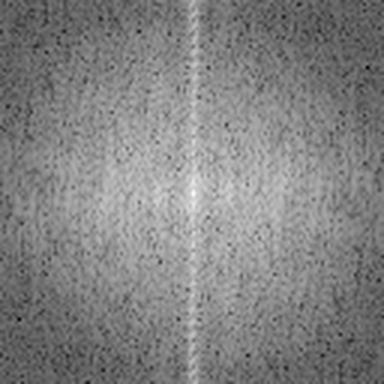
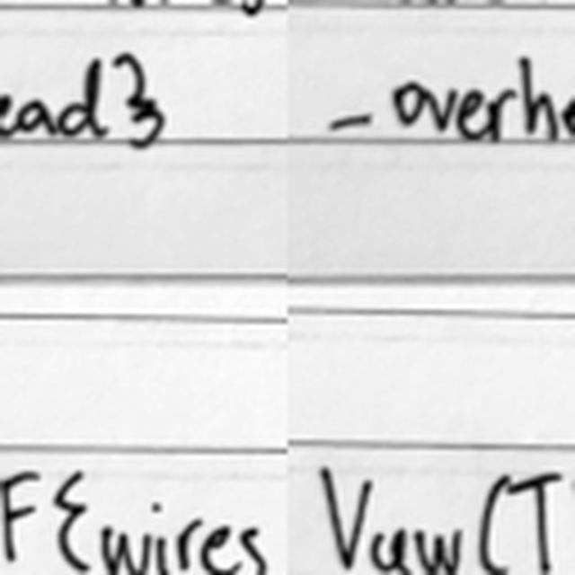
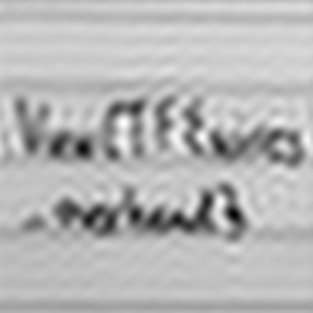
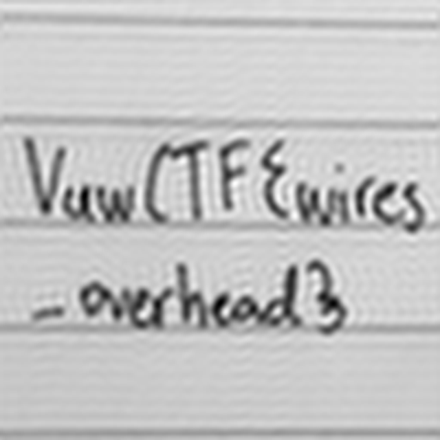

# MRI SIMULATOR 1999

| | |
|---|---|
| **CTF** | VuwCTF 2026 |
| **Category** | misc |
| **Points** | 477 |
| **Solves** | 7 |
| **Difficulty** | medium |
| **Author** | ssourced |

> We're investing in this revolutionary technology allowing you to experience life as an MRI machine.
>
> `nc mri-simulator-onenineninenine.challenges.2026.vuwctf.com 9976`

**Flag:** `VuwCTF{wires_overhead}`

---

## TL;DR

The service is a **k-space sampler**. You give it `x,y` coordinates in a 128×128 grid and it returns the complex Fourier coefficient of a hidden image at that point — which is literally what an MRI scanner measures. Pipeline all the queries down one socket, run an inverse 2-D FFT, and the flag appears as a photo of handwritten notebook paper.

```python
img = np.fft.ifft2(np.fft.ifftshift(K)).real
```

---

## Recon

No files are provided — just the netcat endpoint. Connecting gives:

```
|--------------------
| MRI SIMULATOR 1999
|--------------------
|
| Scanner table in place
| Electromagnet field strength at 1.5 tesla
| Receiving coil online
| Image resolution 128x128
|
| Input comma separated coordinates now:
```

The framing is the whole hint. An MRI machine does not measure pixels — it measures **spatial frequencies**. The raw data an MRI acquires lives in what radiologists call *k-space*, and the image is recovered by inverse Fourier transform. "Experience life as an MRI machine" means *you* have to do the acquisition, one k-space point at a time.

Poking at the input confirms it:

```
0,0     -> | Value is -114.85000000000359 + 0.0i
1,1     -> | Value is -39.28278530812878 + 7.980561937987545i
64,64   -> | Value is 256450.10999999987 + 0.0i
-1,3    -> | Invalid coordinates
abc     -> | Invalid coordinates
200,200 -> | Invalid coordinates
```

So: coordinates are `0..127` on both axes, and each returns a **complex** number. Three useful facts fall out immediately.

### 1. The grid is `fftshift`-centred

`64,64` returns `256450.1 + 0.0i` — a huge, purely real value, several orders of magnitude above its neighbours. That is the **DC component**: the sum of every pixel in the image. It sits at `(64,64)`, not `(0,0)`, so the grid is stored in the "centred" convention that everyone displays k-space in, with low frequencies in the middle and high frequencies at the edges.

That single observation determines the whole reconstruction. Because the origin is at index 64, you must apply `ifftshift` before the inverse transform to move it back to index 0 where `numpy` expects it.

### 2. The image is real-valued (Hermitian symmetry)

Sampling points in conjugate pairs about the centre:

| point | value | mirror | value |
|---|---|---|---|
| `(1,1)` | `-39.28278530812878 + 7.980561937987545i` | `(127,127)` | `-39.28278530812963 - 7.980561937987915i` |
| `(65,64)` | `78854.0052874139 - 50682.25300441552i` | `(63,64)` | `78854.00528741392 + 50682.25300441553i` |
| `(70,80)` | `-4317.962301747232 + 266.7096451972194i` | `(58,48)` | `-4317.962301747232 - 266.70964519721895i` |

Every pair matches to ~12 significant figures with the sign of the imaginary part flipped. That is **Hermitian symmetry**:

$$F(x, y) = \overline{F(-x, -y)}$$

which holds *if and only if* the underlying image is real. Two consequences: the reconstruction will come out real (a good correctness check), and **half the grid is redundant** — you only need to request ~8k of the 16384 points and can synthesise the rest by conjugation. In MRI this trick is real and has a name: *partial Fourier* / *half-scan* acquisition.

### 3. The delay is per-connection, not per-query

Each response is preceded by `| Positioning...` and the first reply takes ~7 seconds. Naively that means `16384 × 7s ≈ 32 hours`, which is what makes this challenge look painful.

But the delay is **fixed startup buffering, not per-request cost**. Timing a pipelined batch of 60 queries — writing all of them before reading any — shows every single response landing at once:

```
[(6.96, 45), (6.98, 52), (6.98, 60)]   # (elapsed seconds, replies received)
```

60 replies, all arriving between t=6.96s and t=6.98s. There is no per-query throttle at all. So the correct move is to **never wait for a reply**: dump every coordinate into the socket up front and read the whole stream back.

Full grid: **43 seconds**. Half grid with symmetry: **50 seconds** (the difference is noise — both are dominated by the same fixed startup cost).

---

## Exploitation

### Acquisition

The only subtlety is not deadlocking. If you `sendall()` ~130 KB while the server is still sitting on its startup delay and not draining its receive buffer, you can block. Sending from a background thread in chunks while the main thread reads avoids it:

```python
sock = socket.create_connection((HOST, PORT), timeout=20)
payload = b"".join(b"%d,%d\n" % p for p in points)

def send_all():
    for i in range(0, len(payload), 8192):
        sock.sendall(payload[i:i + 8192])

threading.Thread(target=send_all, daemon=True).start()

buf = bytearray()
while buf.count(b"Value is") < len(points):
    buf += sock.recv(1 << 20)
```

Replies come back strictly in request order, so zipping the parsed values against the coordinate list is enough — no need to echo coordinates back.

```python
VALUE_RE = re.compile(rb"Value is\s*(-?[\d.eE+-]+)\s*\+\s*(-?[\d.eE+-]+)i")
```

Note the regex has to tolerate a leading `-` on the imaginary part, since the server always formats it as `a + bi` even when `b` is negative (`-39.28 + -7.98i`).

### Half-scan

Walking rows `0..64` and truncating the centre row at the midpoint covers every conjugate pair exactly once, plus the four self-conjugate points (the corners and the DC term):

```python
def half_grid(n=128):
    c = n // 2
    pts = []
    for x in range(c + 1):
        for y in range(n):
            if x == c and y > c:
                break          # rest of the centre row mirrors its own first half
            pts.append((x, y))
    return pts                 # 8257 points instead of 16384
```

Filling in the mirror as each sample arrives:

```python
K[x, y] = v
mx, my = (2 * c - x) % n, (2 * c - y) % n    # reflect through the origin at (c, c)
if not seen[mx, my]:
    K[mx, my] = v.conjugate()
```

Reconstructing from these 8257 points and comparing against a full 16384-point capture gives a max absolute difference of **3e-11** in k-space and **4e-14** in the image. The symmetry is exact.

### Reconstruction

```python
img = np.fft.ifft2(np.fft.ifftshift(K)).real
```

Two details matter here, and both are easy to get wrong:

- **`ifftshift` on the input** — because the DC term is at `(64,64)` rather than `(0,0)`. Skip it and you get a checkerboard-modulated mess.
- **No `fftshift` on the output.** The *result* is already in the correct spatial arrangement.

The residual imaginary component is a good sanity check on the whole pipeline:

```
[*] residual imaginary part: 1.072e-15 (vs real max 125.42)
```

That's pure floating-point noise, ~17 orders of magnitude below the signal. If your shift convention is wrong this number stays small too (a shift is still unitary), so it isn't a complete check — but if it ever comes back *large*, something is genuinely broken.

---

## Results

Log-magnitude of the acquired k-space — bright cross through the centre from the strong horizontal ruled lines of the notebook paper, energy concentrated at low frequencies as expected for a photo:



Inverse FFT gives the flag, handwritten on lined paper:


```
VuwCTF{wires_overhead}
```

---

## The wrong turn

My first render applied `fftshift` to the **spatial output** as well as `ifftshift` to the input. A spatial-domain shift is a circular rotation by half the image in each axis, so it swaps the picture's quadrants and cuts the flag into four pieces:



The flag is still fully present here — reading the quadrants back in the right order gives `VuwCT` + `F{wires` + `_overhe` + `ead}`. Dropping the output shift assembles it properly.

Worth internalising as a rule of thumb: **`ifftshift` belongs on k-space, never on the reconstructed image.**

---

## Shortcut: you don't need the whole grid

Natural images put almost all their energy at low spatial frequencies, and the centre of k-space is exactly where those live. Reconstructing from only the central *n*×*n* block, zero-filling everything else:

| centre block | points needed | result |
|---|---|---|
| 16×16 (1.6%) | 256 |  |
| 32×32 (6.3%) | 1024 |  |
| 64×64 (25%) | 4096 |  |

At 32×32 the flag is guessable; at **64×64 it is completely readable off 4096 queries** — a quarter of the grid. Combined with Hermitian symmetry that's ~2k requests. If you hadn't spotted that the delay was per-connection rather than per-query, this is the escape hatch that still makes the challenge tractable, and the ringing you can see around the strokes is Gibbs artefact — the same thing that shows up in genuinely under-sampled clinical MRI scans.

---

## Solve script

[`solve.py`](solve.py) — end-to-end, no arguments required.

```console
$ python3 solve.py
[*] requesting 8257 k-space points from mri-simulator-onenineninenine.challenges.2026.vuwctf.com:9976
[*] 2064/8257 samples  (18.3s)
[*] 4169/8257 samples  (31.1s)
[*] 6187/8257 samples  (39.9s)
[*] 8257/8257 samples  (50.3s)
[+] 8257/8257 samples in 50.3s
[*] residual imaginary part: 1.072e-15 (vs real max 125.42)
[+] wrote flag.png

Flag: VuwCTF{wires_overhead}
```

| flag | description |
|---|---|
| *(none)* | half-scan acquisition + reconstruct, writes `flag.png` |
| `--full` | request all 16384 points instead of exploiting symmetry |
| `--replay FILE` | rebuild from a saved transcript, no network needed |
| `--ascii` | also dump a terminal preview, for when you have no image viewer |

Requires `numpy`; `Pillow` is optional (without it the script saves a raw `.npy`).

`--ascii` output, in case you're solving over SSH:

```
      ..
.    .:#=........    ..   .    ..   .....:-....:-===-. ..:-===:    .:=+:
      .+#:    -#=                     .=#*+****+%-.   .*%+:.      .++:.
       :#+.  :*+.                    .+%-      .*-     =#:   .   .+#-::.
      ..=#- .=#:                    .-#-        +-     -%#*+=-     .*%*-
        :**.:#-   . .:-..:.    .::  .**.        +-     :#=         +=.    .==.
        .-#==+  :*=.+@%--%= -#--#=  .#+         ==     .*+        .*:     -%=.+*  .#===  =@= .-#%#-  -%+
         .=%#.  =%:.*@#:.**:=@*=%-  :#+         -*.    .=#:        =#=.   :#+=#*. -#:=+  -%- -%+.     .++:
          .-=   .-+++**=.:+##**#*.  .-**+=:     -#-      .          :=**-  -#%=-*-**.-#: .=- .=#+---=:  =#:
```

---

## Takeaways

- **Read the flavour text as a spec.** "Experience life as an MRI machine", "receiving coil", "image resolution" — the challenge tells you it's a Fourier acquisition before you send a single byte.
- **Probe `(0,0)` and the centre first.** Finding the DC term is what pins down the shift convention, and the shift convention is the entire difficulty of the reconstruction.
- **Check whether a delay is per-request or per-connection before assuming a challenge is a grind.** A 32-hour brute force became a 50-second one purely by not waiting for replies. This generalises well past this challenge — any interactive service that looks rate-limited is worth a pipelining test.
- **Symmetry in the response data is free information.** Two conjugate samples told us the target was a real image and halved the work.
