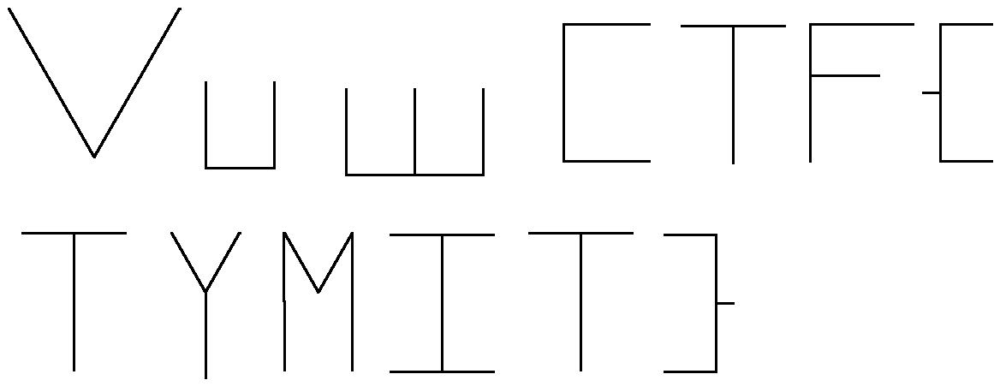

# squeak — VuwCTF 2026 (misc)

> *"A long time ago, in a land far away, I wrote a program that paints you the flag"*

| | |
|---|---|
| **Category** | misc |
| **Challenge** | squeak |
| **Files** | `program` (77,687 bytes) |
| **Flag** | `VuwCTF{TYMIT}` |

---

## TL;DR

`program` is a **Scratch 1.4 project** with its file header surgically removed — what's left is the raw *Squeak object store*. Inside is one sprite running a single 200-block script: a pure turtle-graphics program that pen-draws the flag as line art.

Solving it means writing a Squeak object-store parser, rebuilding the block chain out of the stored *block morphs*, then simulating the pen — with two deliberate twists in the turtle semantics.

```
$ python3 solve.py
[+] FLAG: VuwCTF{TYMIT}
```

---

## 1. Recon

```console
$ file program
program: Apache Avro version 83

$ xxd program | head -3
00000000: 4f62 6a53 0153 7463 6801 0000 0e6d 1400  ObjS.Stch....m..
00000010: 0000 0163 0000 0214 0000 0002 6300 0003  ...c........c...
00000020: 6300 0004 0900 0000 0570 6167 6531 1400  c........page1..
```

`file` is wrong — it's pattern-matching on nothing useful. The real tell is the first nine bytes:

```
4f 62 6a 53 01 53 74 63 68 01   ->   "ObjS\x01Stch\x01"
```

That's the magic of a **Squeak object store**, the serialisation format used by **Scratch 1.4** — which is itself written in Squeak Smalltalk. Hence the challenge name, and *"a long time ago"* (Scratch 1.4 is from 2009).

`strings` confirms the theme immediately:

```console
$ strings program | tail -30
pen color %c
penColor:
pen down
putPenDown
wait %n
wait:elapsed:from:
set %v to %n
set:to:
forward %n
forward:
goto
(29, 54)
...
```

Scratch block specs (`forward %n`) alongside their Smalltalk selectors (`forward:`). So: a pen-drawing program. Matches *"paints you the flag"*.

### Why nothing will open it

A real `.sb` file is laid out as:

```
"ScratchV02"          10 bytes
<info size>            4 bytes, big-endian
<info object table>    "ObjS\x01Stch\x01" ...
<contents object table>"ObjS\x01Stch\x01" ...
```

But this file contains **exactly one** object table, starting at offset 0:

```console
$ python3 -c "
import re; d=open('program','rb').read()
print([m.start() for m in re.finditer(b'ObjS\x01Stch\x01', d)])"
[0]
```

The `ScratchV02` magic, the length field and the entire info table were stripped. Scratch, `kurt`, and every `.sb` tool will reject it. So we write our own parser.

---

## 2. The Squeak object store format

The format is refreshingly simple:

```
"ObjS\x01Stch\x01"
uint32  object_count
object * object_count
```

Every object begins with a one-byte **class id** that decides how the rest is read. Objects are numbered 1..N in file order, and *cross-references are by index* — class id `99` followed by a 3-byte big-endian index. That's why the hexdump is littered with `63 00 00 01` (`0x63` = 99).

### Fixed-format types

| ID | Type | Payload |
|---:|---|---|
| 1 / 2 / 3 | `nil` / `true` / `false` | — |
| 4 | SmallInteger | int32 BE |
| 5 | SmallInteger16 | int16 BE |
| 6 / 7 | LargePositive/NegativeInteger | uint32 len + little-endian bytes |
| 8 | Float | IEEE-754 double BE |
| 9 / 10 | String / Symbol | uint32 len + bytes |
| 11 | ByteArray | uint32 len + bytes |
| 12 | SoundBuffer | uint32 len + len×2 bytes |
| 13 | Bitmap | uint32 len + len×4 bytes |
| 14 | UTF-8 String | uint32 len + bytes |
| 20–23 | Array / OrderedCollection / Set / IdentitySet | uint32 count + count objects |
| 24 / 25 | Dictionary / IdentityDictionary | uint32 count + count key/value pairs |
| 30 | Color | uint32, **10 bits per channel** |
| 31 | TranslucentColor | uint32 + alpha byte |
| 32 | Point | 2 objects |
| 33 | Rectangle | 4 objects |
| 34 / 35 | Form / ColorForm | 5 / 6 objects |
| 99 | **object reference** | uint24 BE index |
| ≥100 | **user-class object** | version byte, field-count byte, N objects |

Implemented, it parses cleanly — and the byte count is the proof the format guess is right:

```console
[*] parsed 3693 objects, consumed 77687/77687 bytes
```

Not one trailing byte. 

---

## 3. Identifying the classes

User-class objects only carry a numeric id, not a name. The published Scratch class tables didn't line up with this file, so rather than guess, identify them **by field layout**:

```console
raw class-id histogram:
{103: 1, 105: 498, 106: 160, 120: 1, 141: 1,
 142: 160, 144: 13, 146: 43, 148: 199, 151: 1, 153: 1}
```

Dumping one instance of each, resolved one level deep:

| ID | Count | Identified as | Evidence |
|---:|---:|---|---|
| 103 | 1 | `EllipseMorph` | bounds + fill/border colour |
| 105 | 498 | `StringMorph` | `f6 = ['ComicBold', 19]`, `f8 = 'script1'` |
| 106 | 160 | `UpdatingStringMorph` | `f8 = '0.1'`, `f11 = 'expression'` |
| **120** | 1 | **ScratchSpriteMorph** | `f6 = 'sprite12'`, `f9 = Form(87×40×8)`, `f13 = 180.0` |
| **151** | 1 | **hat block** | label child = `'script1'`, owns the stack |
| **148** | 199 | **command block** | `f8 = 'goto %p'`, `f12 = 'referencePosition:'` |
| 153 | 1 | `ScratchScriptsMorph` (scripts pane) | submorphs = `[151]` |
| 141 | 1 | colour arg morph | `f3 = Color(183, 523, 600)` |
| 142 | 160 | numeric/expression arg | wraps an `UpdatingStringMorph` |
| 144 | 13 | point arg morph | `f9 = Point(29, 54)` |
| 146 | 43 | variable arg morph | wraps a `StringMorph` |

The counts already tell the story: **199 command blocks + 1 hat = 200 blocks**, and **13 point args = 13 `goto`s = 13 glyphs**.

### The catch: scripts are morphs, not arrays

In `.sb` **JSON/`.sprite` exports** scripts are flat arrays like `[["forward:", 100], ...]`. In the **binary** format they are stored as *live Morphic objects* — real `CommandBlockMorph`s with their rendering state, labels and argument sub-widgets.

That's why a naive search for `['forward:', ...]` arrays finds nothing, and why blindly dereferencing produces megabytes of cyclic UI junk (my first attempt spat out a 4 MB `repr` of one block).

Command block (`148`) layout:

| Field | Meaning |
|---|---|
| `f0` | bounds (`Rectangle`) |
| `f1` | owner |
| `f2` | **submorphs — contains the next block in the stack** |
| `f3`, `f7` | colour |
| `f8` | **commandSpec** — e.g. `'forward %n'` |
| `f9` | **argMorphs** |
| `f10` | label `StringMorph` |
| `f11` | receiver (the sprite) |
| `f12` | **selector** — e.g. `'forward:'` |

The **next block is a submorph of the current one**, mixed in with the block's own label/arg chrome. Walking the stack means picking the submorph that is itself a block morph:

```python
nxt = [s for s in store.deref(f[F_SUBMORPHS])
       if store.cid(s) in (CMD_BLOCK, HAT_BLOCK)]
cur = store.deref(nxt[0]) if nxt else None
```

Bounds confirm it — `obj 23` spans y 426→450, `obj 286` spans y 450→474: stacked directly beneath.

---

## 4. The recovered program

```
[*] recovered script: 200 blocks
      wait:elapsed:from:     x65
      forward:               x52
      set:to:                x43
      referencePosition:     x13
      putPenDown             x13
      putPenUp               x12
      HAT                    x1
      penColor:              x1
```

```
when script1 clicked
  goto (29, 54)
  pen color [Color(183, 523, 600)]
  pen down
  wait 0.1
  set heading to 60
  forward 100
  wait 0.1
  set heading to 300
  forward 100
  wait 0.1
  pen up
  goto (144, 97)
  pen down
  ...
```

No loops, no conditionals, one pen colour, 13 `goto`/`pen down` groups. Everything needed is in the geometry — the 65 `wait 0.1` blocks are pure theatre (they just make the drawing animate).

---

## 5. Simulating the pen — the two twists

### Twist 1: `heading` is a *variable*, not the sprite's direction

The blocks are `set:to:` with a variable named `heading`:

```
set [heading] to (60)
forward (100)
```

Scratch's actual "point in direction" block is `heading:` — it appears **nowhere** in this project. `forward:` ("move n steps") uses the sprite's real direction, which this script never touches. Run as-is in Scratch 1.4, every stroke would fire off in the same direction and draw garbage.

The user variable is what's meant to drive direction. Treat `set heading to N` as the turtle's angle.

### Twist 2: the angles aren't Scratch's convention

Scratch uses **0° = up, clockwise**. Applying it gives clean, well-formed glyphs that are all **rotated 90°**:

<p align="center"><em>Scratch convention (dx = sin θ, dy = −cos θ) — legible but sideways:</em></p>

```
 >    ⊐  ⊟     ⊥      ...
```

The `goto` coordinates are also y-down screen coordinates (x: 29–603, y: 54–265), not Scratch's y-up stage coordinates. The convention that actually works is **clockwise-from-east on a y-down canvas**:

```python
dx = n * cos(radians(heading))
dy = n * sin(radians(heading))     # +y is down
```

Sanity-check it against the first three glyphs before rendering anything:

| Glyph | Blocks | Under `cos/sin`, y-down | Letter |
|---|---|---|---|
| 1 | `h=60 f100`, `h=300 f100` | down-right, then up-right | `V` |
| 2 | `h=90 f50`, `h=0 f40`, `h=270 f50` | down, right, up | `u` |
| 3 | same, twice | two `u`s | `w` |

`Vuw` — the flag prefix. Convention confirmed before a single pixel is drawn.

---

## 6. Rendering

52 pen-down strokes across 13 glyphs:



```
 #                           ##
 ###                        ##                                     ################                    ##################   ##########
  ###                      ##                                      ################  ################   ##################   ##########
   ###                   ###                                       ##                       #          #                    ##
     ##                 ###                                        ##                       #          #                    ##
      ##               ###                                         ##                       #          #                    ##
       ##             ###         #          #                     ##                       #          ############         ##
        ###          ##           #          #     #     #    #    ##                       #          #                 #####
         ###        ##            #          #     #     #    #    ##                       #          #                    ##
          ###      ##             #          #     #     #    #    ##                       #          #                    ##
           ###   ###              #          #     #     #    #    ##                       #          #                    ##
             ## ###               #          #     #     #    #    ##                       #          #                    ##
              ####                #          #     #     #    #    ##                       #          #                    ##
               ##                 ############     #     #    #    ################         #          #                    ##########
                                  ############     ###############
   ###################      ##         ##      ##        ##      ##################     ##################    ##########
            #                ##      ###       ###      ###              #                      ##                     #
            #                 ##    ###        # ##    ####              #                      ##                     #
            #                  ##  ###         #  ##  ### #              #                      ##                     #
            #                   #####          #   ####   #              #                      ##                     #
            #                    ##            #    ##    #              #                      ##                     #
            #                     #            #          #              #                      ##                     ####
            #                     #            #          #              #                      ##                     #
            #                     #            #          #              #                      ##                     #
            #                     #            #          #              #                      ##                     #
            #                     #            #          #      ##################             ##            ##########
                                  #                              ##################                           ##########
```

### Verifying the inner glyphs

The braces make the format obvious, but the payload deserves a check against raw stroke coordinates rather than eyeballing pixels:

```
=== glyph 7  start (37, 185)        === glyph 10 start (252, 186)
   (37,185)  -> (97,185)               (252,186) -> (312,186)
   (97,185)  -> (67,185)               (312,186) -> (282,186)
   (67,185)  -> (67,265)               (282,186) -> (282,266)
                          => T         (282,266) -> (252,266)
                                       (252,266) -> (312,266)
=== glyph 8  start (124, 185)                                => I
   (124,185) -> (144,220)
   (144,220) -> (164,185)           === glyph 11 start (333, 185)
   (164,185) -> (144,220)              (333,185) -> (393,185)
   (144,220) -> (144,270)              (393,185) -> (363,185)
                          => Y         (363,185) -> (363,265)
                                                             => T
=== glyph 9  start (190, 265)
   (190,265) -> (190,185)           === glyph 12 start (412, 186)
   (190,185) -> (210,220)              top bar, down, tick right,
   (210,220) -> (230,185)              tick back, down, bottom bar
   (230,185) -> (230,265)                                    => }
                          => M
```

`T Y M I T }` — unambiguous.

**On casing:** `u` and `w` are drawn 50 px tall while every glyph inside the braces is 80 px tall, so the lowercase/uppercase split is real geometry, not a reading choice. The payload is uppercase.

---

## 7. Solution

Full, dependency-free solver: [`solve.py`](solve.py) (Pillow optional, only to also emit a `.png`).

```console
$ python3 solve.py
[*] file: program (77687 bytes)
[*] parsed 3693 objects, consumed 77687/77687 bytes
[*] recovered script: 200 blocks
[*] simulated pen: 52 strokes in 13 glyphs
[*] wrote flag.pgm
...
[+] FLAG: VuwCTF{TYMIT}
```

Pipeline:

1. **`ObjectStore`** — parses the Squeak object store (all 36 fixed-format types + refs + user classes).
2. **`extract_script`** — finds the hat block, walks the stack through `submorphs`.
3. **`arg_value`** — unwraps point / colour / expression / variable arg morphs.
4. **`simulate`** — runs the turtle with the corrected heading convention, grouping strokes per `goto` into glyphs.
5. **`rasterise` / `to_ascii` / `write_pgm`** — renders the line art.

---

## Flag

```
VuwCTF{TYMIT}
```

---

## Takeaways

- `file` gave a confidently wrong answer (`Apache Avro version 83`). Nine bytes of hexdump gave the right one.
- A stripped header doesn't destroy a format, it just removes the tooling. The body was completely intact.
- **Byte-exact consumption** (`77687/77687`) is the cheapest possible proof that a hand-written parser is correct — worth checking before trusting anything downstream.
- Identify unknown type tags by **field layout**, not by trusting a table you half-remember. The canonical Scratch class ids did not match this file.
- Sanity-check a coordinate convention against the *known* part of the answer (the `VuwCTF{` prefix) before rendering — it collapsed a 4-way ambiguity in seconds.
